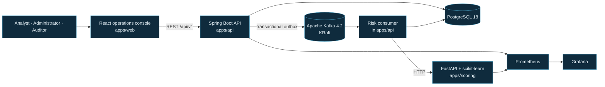
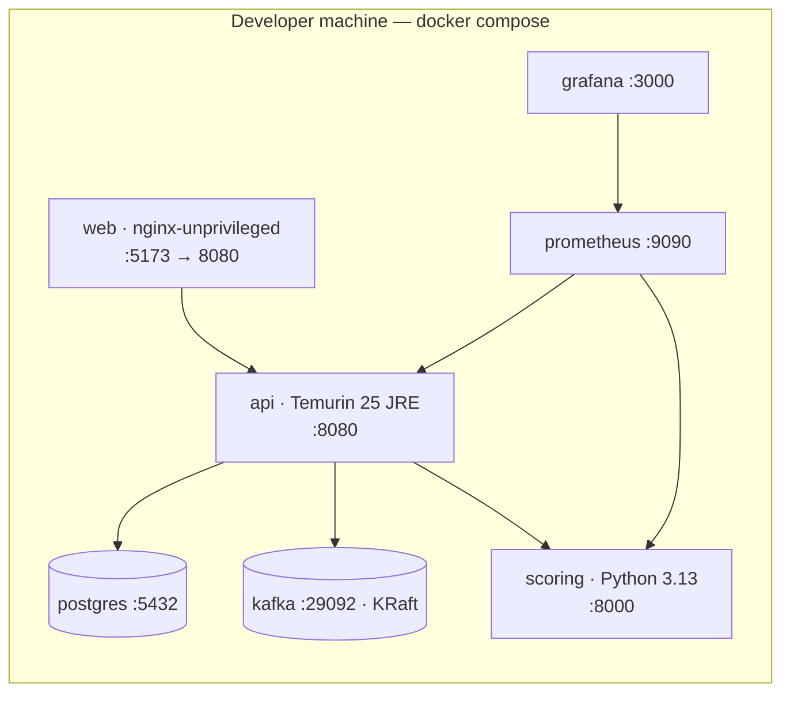

# SentinelFlow

**An event-driven transaction-risk and fraud-operations platform — built end to end on synthetic
data, to be read as engineering rather than as a product.**

[](https://github.com/la3679/sentinelflow/actions/workflows/ci-repo.yml)
[](https://github.com/la3679/sentinelflow/actions/workflows/ci-api.yml)
[](https://github.com/la3679/sentinelflow/actions/workflows/ci-scoring.yml)
[](https://github.com/la3679/sentinelflow/actions/workflows/ci-web.yml)
[](https://github.com/la3679/sentinelflow/actions/workflows/ci-containers.yml)
[](https://github.com/la3679/sentinelflow/actions/workflows/security-scan.yml)
[](LICENSE)

---

> ### Please read this first
>
> SentinelFlow is an **independent, educational, open-source portfolio project**. It is **not**
> affiliated with, endorsed by, or derived from any bank, financial institution, or employer.
>
> It runs entirely on **fictional synthetic data** that it generates itself. It contains no real
> accounts, no real transactions, and no personal data of any kind. It executes no financial
> transaction, makes no financial decision, and is not a regulatory compliance product or a
> production fraud-decision engine.
>
> Every figure in this README came from a command that was actually run. The date and the command
> are recorded next to it.

---

## Current status — Phases 0 to 4 complete, Phase 5 next

This is an in-progress build, and the README says where it actually is rather than describing the
finished system as though it were running.

| Phase | Scope                                              | State        |
| ----- | -------------------------------------------------- | ------------ |
| 0     | Research gate, product baseline, repository        | **complete** |
| 1     | Monorepo, developer foundation, CI, containers     | **complete** |
| 2     | Contracts, domain model, PostgreSQL migrations     | **complete** |
| 3     | Transaction ingestion, transactional outbox, Kafka | **complete** |
| 4     | Synthetic data generation and risk scoring         | **complete** |
| 5     | Alert lifecycle, investigations, audit             | **next**     |
| 6     | Operations console wired to the real API           | not started  |
| 7     | Observability and resilience                       | not started  |
| 8     | Security and release-quality hardening             | not started  |
| 9     | Performance, documentation, clean-clone check      | not started  |
| 10    | v1.0.0 release                                     | not started  |

**What runs today:** `docker compose up` starts PostgreSQL, Kafka, the Spring Boot API, the FastAPI
scoring service, the console, Prometheus and Grafana; all seven report healthy and Prometheus
scrapes both services.

The pipeline is end to end. A transaction posted to `/api/v1/transactions` is written with its
outbox row in one database transaction, published to Kafka by the relay, consumed idempotently, and
either handled or dead-lettered with a classified reason. `make seed` fills the stack with
deterministic synthetic traffic that travels that same path.

**Scoring answers.** A model is trained, evaluated and committed to the registry, and the scoring
service serves it: `POST /v1/score` returns a score, bounded reason codes, the model and feature
versions, and a measured inference duration; `GET /v1/model` publishes what that model was measured
at. Every figure comes from the run recorded in [`docs/ml/MODEL_CARD.md`](docs/ml/MODEL_CARD.md), on
synthetic data.

**The rules answer too, in-process.** Seven transparent indicators run inside `apps/api` — velocity,
an amount against the account's own baseline, a new device, a country change, the small hours, a
balance drain, distinct merchants within the hour — because that is what has to answer when the
scoring service cannot be reached. They are also the floor the model is measured against: the same
engine scores every example as the labelled dataset is exported, so the margin in the model card is
a margin over the ruleset that actually ships rather than over a reimplementation of it.

**The two halves are joined, and the decision is persisted.** The consumer assembles a bounded
account context, evaluates the ruleset in process, calls `POST /v1/score` inside a budget under ten
seconds, combines the two scores under a versioned policy, bands the result, and writes a
`risk_assessments` row with every version that contributed — model, feature, ruleset and policy — in
the same database transaction as the ledger row that records the event as handled. `make replay`
demonstrates the failure behaviour rather than describing it: it stops the scoring container, shows
assessments degrade to the rules alone, restarts it, and shows them scored again.

**What does not run yet:** no alert is raised. Every assessment is banded and every band is
persisted, and nothing reads them — alert creation, the investigation workflow and the read
endpoints are Phases 5 and 6, which is also why the console still renders from a mock fixture
layer.

Detail: [`PROJECT_STATE.md`](PROJECT_STATE.md) · [`docs/planning/IMPLEMENTATION_PLAN.md`](docs/planning/IMPLEMENTATION_PLAN.md)

## Why this project exists

Most portfolio projects are a CRUD application with a login screen. The interesting problems in
transaction risk are not CRUD problems:

- **A state change and the event announcing it must be atomic.** Writing a row and then publishing
  to Kafka is two operations with a window between them; a crash in that window loses the event
  silently. SentinelFlow uses a transactional outbox.
- **Delivery is at-least-once, so consumers must be idempotent.** A duplicate is normal traffic,
  not an incident.
- **Money is not a float**, anywhere — not in the database, the API, the events, or the UI.
- **Fraud labels are extremely imbalanced**, so accuracy is close to meaningless. Precision, recall,
  PR-AUC and an explicit operating threshold are what mean anything.
- **An alert is a workflow, not a row.** It has valid transitions, an assignee, an audit trail, and
  a reviewer whose decision has to be defensible later.
- **An analyst stares at the console for a whole shift.** Density, keyboard operation and
  accessibility are functional requirements, not polish.

It draws on the kinds of responsibilities involved in enterprise transaction services, event
streaming, and anomaly detection. It reproduces **no** proprietary code, schema, rule, metric, or
workflow from any employer.

## The console


Generated from the production bundle by
[`apps/web/tests/e2e/screenshots.spec.ts`](apps/web/tests/e2e/screenshots.spec.ts), so they cannot
drift from the build.

**Every number in those images is a mock fixture, not a measurement.** The latency and consumer-lag
figures shown are synthetic sample data for layout purposes. SentinelFlow has measured no
performance yet; that is Phase 9, and the results will be reported with the method that produced
them.

## Architecture



Every box exists and runs today, and so does every link between them. The consumer's call to the
scoring service was the last one to be drawn solid: it is synchronous HTTP from inside the handler,
with a timeout, a bounded retry and a circuit breaker, and an unreachable scoring service degrades
an assessment to the rules rather than losing it
([ADR-0008](docs/adr/0008-scoring-service-boundary.md)).

The API is the only backend the console talks to; scoring is reached through the API and never
directly by the browser. One authorization boundary, one audit trail, one place to rate-limit. See
[ADR-0002](docs/adr/0002-monorepo-and-service-boundaries.md).

### Local deployment



Every container runs as a non-root user and declares a health check; CI asserts the non-root user
against the built image rather than trusting the Dockerfile.

Diagrams arrive with the behaviour they describe. The ER diagram and the transaction-to-alert flow
exist — [`docs/architecture/DATA_MODEL.md`](docs/architecture/DATA_MODEL.md) and
[`TRANSACTION_TO_ALERT.md`](docs/architecture/TRANSACTION_TO_ALERT.md), both generated from
`information_schema` on a database the migrations built, with a test asserting the ER diagram's
entities are exactly the tables that exist. The alert state machine arrives with Phase 5.

## Technology

Chosen with a reason, and recorded. Every version below is pinned and justified in
[`docs/research/RESEARCH_LOG.md`](docs/research/RESEARCH_LOG.md).

| Choice                                   | Why this and not something else                                                                                                              |
| ---------------------------------------- | -------------------------------------------------------------------------------------------------------------------------------------------- |
| **Java 25 LTS + Spring Boot 4.1.1**      | Transactional integrity and the outbox belong where mature transaction management lives. LTS because a stranger has to build this in a year. |
| **PostgreSQL 18.6**                      | `NUMERIC` for money, real constraints, and partial indexes. Tested against real PostgreSQL — **H2 is never accepted as evidence**.           |
| **Apache Kafka 4.2.1, KRaft**            | The exact broker version the Spring Boot BOM's client targets. KRaft removes ZooKeeper from the stack entirely.                              |
| **Flyway**                               | Versioned, immutable, forward-only migrations. `ddl-auto` is `validate`, never `update`.                                                     |
| **Python 3.13 + FastAPI + scikit-learn** | The model belongs in the scientific stack. 3.13 exactly, because numpy needs ≥3.12 and joblib declares support only through 3.13.            |
| **uv**                                   | Provisions the interpreter and locks the tree, so the reference machine's system Python 3.11 is irrelevant.                                  |
| **React 19 + TanStack Router**           | Lovable's generated foundation, adopted after audit rather than rewritten. [ADR-0009](docs/adr/0009-frontend-component-library.md).          |
| **Redux Toolkit + RTK Query**            | One data layer. The mock adapter swaps for a real base query in one place.                                                                   |
| **shadcn/ui on Radix**                   | Radix supplies the focus management, keyboard interaction and ARIA semantics WCAG 2.2 AA needs. MIT, no paid tier.                           |
| **Bun**                                  | One package manager, one lockfile, one workspace root.                                                                                       |
| **Prometheus + Grafana**                 | Scraping and dashboards without an account or an egress dependency.                                                                          |

Deliberately **not** used: Redis, Kubernetes, GraphQL, a graph database, and an LLM. None has
demonstrated a need here, and adding one for appearance is how a portfolio project stops being
credible.

## Repository structure

```text
apps/api/        Spring Boot — transactions, outbox, alerts, audit
apps/scoring/    FastAPI — features, inference, model registry
apps/web/        React operations console
infra/           Prometheus, Grafana, and container configuration
scripts/         Developer, smoke, and checkpoint scripts
docs/            ADRs, research, planning, operations, frontend
compose.yaml     The whole local stack
Makefile         The command surface (PowerShell equivalent in scripts/dev/sf.ps1)
```

`contracts/` and `data/` appear in Phases 2 and 4, with their first real files. Empty placeholder
directories are not created.

## Quickstart

### Prerequisites

| Tool                            | Why                                          | Required                           |
| ------------------------------- | -------------------------------------------- | ---------------------------------- |
| Docker + Compose v2             | Runs the whole stack                         | yes                                |
| [Bun](https://bun.sh) ≥ 1.4     | The only Node package manager used           | yes                                |
| [uv](https://docs.astral.sh/uv) | Provisions Python 3.13                       | yes                                |
| Git                             | —                                            | yes                                |
| JDK 25 (Temurin)                | Only to build `apps/api` outside a container | no — `make up` builds it in Docker |

`make bootstrap` checks all of these and tells you which are missing.

### Run it

```bash
git clone https://github.com/la3679/sentinelflow.git
cd sentinelflow
make bootstrap     # verify prerequisites, generate a local .env with fresh secrets
make up            # build and start everything, waiting until all seven are healthy
make smoke         # 23 checks against the running stack
```

On Windows without `make`, every target is available natively in PowerShell:

```powershell
.\scripts\dev\sf.ps1 bootstrap
.\scripts\dev\sf.ps1 up
.\scripts\dev\sf.ps1 smoke
```

Then:

| Service          | URL                                     |
| ---------------- | --------------------------------------- |
| Console          | <http://localhost:5173>                 |
| API health       | <http://localhost:8080/actuator/health> |
| Scoring health   | <http://localhost:8000/health/ready>    |
| Scoring API docs | <http://localhost:8000/docs>            |
| Prometheus       | <http://localhost:9090>                 |
| Grafana          | <http://localhost:3000>                 |

`make down` stops the stack and keeps your data. `make reset-demo` deletes the volumes, and asks
you to type `reset` first.

### Credentials

There are none to find and none committed. `make bootstrap` generates a random PostgreSQL password
and a random Grafana admin password into `.env`, which is git-ignored. Compose refuses to start if
either is missing rather than falling back to something guessable — you can see this in
[`compose.yaml`](compose.yaml).

The console's sign-in screen is **presentational only**. It has no password field and no real
authentication, and it says so on screen. Real authentication is Phase 8.

Every variable is documented in [`.env.example`](.env.example) with its default, whether it is
required, whether it is sensitive, and which component reads it.

## Commands

```bash
make help              # every target, with a description
make up / down / ps / logs
make reset-demo        # destructive, with confirmation
make build             # build all three applications
make test              # every standard suite
make test-e2e          # Playwright, accessibility, responsive
make lint              # eslint · ruff · mypy · spotless
make format-check
make security          # gitleaks over the whole history
make smoke             # verify the running stack actually serves
make clean
```

`make seed` loads the deterministic demo dataset: the parties, and the synthetic traffic the scenario
generator lays over them. Running it twice is a no-op —
[`docs/data/DATA_PROVENANCE.md`](docs/data/DATA_PROVENANCE.md) records what it writes, what it
deliberately does not, and why the labels never reach the database.

`make replay` replays the two **operational** scenarios, which is a deliberately narrower thing
than it sounds. The transaction shapes — velocity, amount spikes, card testing, drains, off-hours —
are what `make seed` generates, through the same validation and the same outbox row as a posted
transaction, so replaying them again here would be a second implementation of something that exists.
What nothing else produces is a scoring-service outage and a malformed event reaching the
dead-letter path, and those are what it runs:

```bash
make replay                       # both scenarios
SCENARIO=scoring-outage make replay
SCENARIO=poison-event make replay
```

The outage scenario stops the scoring container, posts transactions, prints the degraded assessments
the pipeline produced, restarts it, waits out the circuit breaker's open window, and prints the
scored ones. The poison scenario publishes two records, because there are two outcomes and only one
is a dead letter: a well-formed envelope at an unsupported schema version is dead-lettered with its
failure class and coordinates, while a record that is not a readable envelope at all is deliberately
**not** — the dead-letter schema requires a valid envelope and ADR-0006 §4 forbids copying
unsanitised content onto an operational topic, so it is counted and logged instead.

The HTTP replay endpoint the requirements list is a separate thing on a separate schedule: it is API
surface that needs authorization and rate limiting, and shipping an unbounded replay endpoint with
no role behind it to satisfy a Makefile target would be the wrong trade.

## Testing

Every figure below came from a run that actually happened, and each block says when. Nothing here
is estimated, and a figure that has not been re-measured keeps the date it was measured on rather
than being quietly refreshed.

**2026-08-27**, on the commit that joined the ruleset, the model and the policy into a persisted
assessment:

| Suite                             | Command                | Result                                            |
| --------------------------------- | ---------------------- | ------------------------------------------------- |
| API — full verify                 | `./mvnw verify`        | **147 unit + 172 integration passed**, gate met   |
| API — coverage                    | JaCoCo, both suites    | 85.7% lines (1794/2093), 76.9% branches (362/471) |
| Documentation links, placeholders | `make docs-check`      | **PASS** — 154 links across 41 files, 0 broken    |
| Contracts                         | `make contracts-check` | **PASS** — every schema, example and API document |
| Formatting, repository-wide       | `make format-check`    | **PASS**                                          |

The whole pipeline was also run against the local stack rather than only against Testcontainers,
which is how three defects were found that every suite was green through: no process created the
Kafka topics, so nothing could be published on a stack whose health checks all passed; the scoring
client negotiated HTTP/2 against an HTTP/1.1-only service, so every request was refused; and the
Makefile's PowerShell equivalent could not run two of its targets at all. Each is fixed in this
branch, and the commit messages say what the symptom looked like.

**2026-08-27**, earlier, on the commit that added the scoring endpoints and the rules baseline:

| Suite              | Command                     | Result                                                         |
| ------------------ | --------------------------- | -------------------------------------------------------------- |
| Scoring — unit     | `make test-scoring`         | **171 passed / 171**                                           |
| Scoring — coverage | `uv run pytest --cov`       | 97.36% statements, floor 90                                    |
| Scoring — types    | `uv run mypy`               | strict, **0 issues**, 42 files                                 |
| Scoring image      | `docker build apps/scoring` | **PASS** — 610 MB; serves `/v1/score` with the committed model |

**2026-08-26**, on the commit that finished Phase 3:

| Suite                             | Command                | Result                                                  |
| --------------------------------- | ---------------------- | ------------------------------------------------------- |
| API — full verify                 | `./mvnw verify`        | **57 unit + 116 integration passed**, coverage gate met |
| API — coverage                    | JaCoCo, both suites    | 80.5% lines (1168/1451), 70.0% branches (191/273)       |
| Console — unit                    | `make test-web`        | **24 passed / 24**, 5 files                             |
| Contracts                         | `make contracts-check` | **PASS** — every schema, example and API document       |
| Documentation links, placeholders | `make docs-check`      | **PASS** — 98 links across 35 files, 0 broken           |
| Formatting, repository-wide       | `make format-check`    | **PASS**                                                |

The API's integration suites run against **real PostgreSQL 18.6 and real Kafka 4.2.1** in
Testcontainers, on the GitHub runner as well as locally — the runner's log shows the migrations
applied and the same test counts. H2 is never accepted as evidence, and neither is a mocked broker.

**2026-08-25**, and not re-measured since:

| Suite                    | Command                 | Result                                      |
| ------------------------ | ----------------------- | ------------------------------------------- |
| Console — coverage       | `bun run test:coverage` | 40.4% lines                                 |
| Console — browser + a11y | `make test-e2e`         | **58 passed / 58** (29 desktop + 29 tablet) |
| axe, WCAG 2.1 A/AA       | in the above            | **0 violations**, 8 routes, 2 viewports     |
| Running stack            | `make smoke`            | **23 passed / 0 failed**                    |
| Secrets, full history    | `make security`         | **0 leaks**                                 |
| Container scan           | Trivy in CI             | **0 fixable HIGH or CRITICAL**              |

The console's 40.4% line coverage is honest rather than flattering: its routes are covered by the
Playwright suite instead, and writing unit tests purely to move that number would be
[exactly the shortcut this project refuses](CONTRIBUTING.md).

Both coverage gates are ratchets — measured, then set below the measurement, raised only when a
change genuinely raises coverage, and never lowered to go green. `apps/api` is at LINE 0.80 and
BRANCH 0.70, raised on 2026-08-27 from 0.70 and 0.60 after the assessment workflow measured 85.7%
and 76.9%; `apps/scoring` is at 90% of statements, set when the feature pipeline gave it a baseline
that meant something. `apps/web` has no threshold yet; it gets one in Phase 6.

**No latency, throughput, or false-positive figure is claimed anywhere in this repository.** None
has been measured. Phase 9 measures them and reports the method alongside the result.

## Observability

Prometheus scrapes both services on every `make up`; Grafana comes up with the Prometheus
datasource already provisioned from
[`infra/grafana/provisioning/`](infra/grafana/provisioning/), so a fresh clone needs no clicking.

- API metrics: <http://localhost:8080/actuator/prometheus>
- Scoring metrics: <http://localhost:8000/metrics>
- Targets: <http://localhost:9090/targets>

Dashboards, alert rules and runbooks arrive in Phase 7, with the signals they describe. A dashboard
of empty panels is not observability, and an alert rule with no runbook is a pager nobody knows how
to answer.

The OpenTelemetry Collector is deliberately **absent** from `compose.yaml` until tracing exists in
Phase 7 — a collector that receives nothing is decoration.

## Security

Full policy: [`SECURITY.md`](SECURITY.md). **Report a vulnerability privately**, through
[a GitHub security advisory](https://github.com/la3679/sentinelflow/security/advisories/new) —
never as a public issue.

Controls that exist today, not aspirations:

| Control                     | Where                                                                |
| --------------------------- | -------------------------------------------------------------------- |
| Secret scanning             | gitleaks over full history, every push and pull request, plus weekly |
| Push protection             | Enabled on the repository                                            |
| Dependency review           | Fails a pull request on a high-severity or copyleft addition         |
| Dependabot                  | Weekly across all five ecosystems                                    |
| Container scanning          | Trivy on every image; fails on any fixable HIGH or CRITICAL          |
| Non-root containers         | Asserted in CI against the built image                               |
| Pinned actions              | Third-party actions pinned to an immutable commit SHA                |
| Verified build tooling      | The Maven Wrapper validates a SHA-256 verified against two sources   |
| Least-privilege workflows   | `permissions: contents: read` unless a job needs more                |
| Closed management endpoints | Only health, info and prometheus — asserted by test _and_ by smoke   |
| Protected `main`            | Pull requests and nine passing checks, with no bypass actors         |

### Known limitations, stated plainly

- **There is no authentication yet.** Phase 8. The sign-in screen is presentational and says so.
- **Role handling in the console is a UX affordance, never a security boundary.** Disabling a
  control authorizes nothing.
- **The local stack is not a deployment target.** It binds to your machine, holds only synthetic
  data, and has never been hardened for exposure. Do not put it on a network you do not control.
- **Screen-reader behaviour is unverified.** axe finds roughly a third of real accessibility
  issues; a manual pass is Phase 6.

## Development workflow

This repository was created by [Lovable](https://lovable.dev), which built the reviewed frontend
foundation; everything since has been built locally with Claude Code. The full history, including
Lovable's original root commit, is preserved — nothing has been squashed or rewritten.

Phase 1 moved the console to `apps/web/`, which ends Lovable's ability to regenerate this project,
because Lovable has no documented support for an application outside the repository root. That
trade-off, and the two honest routes back to a design session, are recorded in
[`docs/operations/LOVABLE_GITHUB_WORKFLOW.md`](docs/operations/LOVABLE_GITHUB_WORKFLOW.md).

## Deployment

**The local Docker Compose environment is the supported way to run SentinelFlow.** There is no
hosted demo, and this README will not link to one that does not exist.

Public cloud deployment is optional, out of scope for v1, and would **incur cost**. Nothing in this
repository provisions a billable resource.

## Troubleshooting

| Symptom                                             | Cause and fix                                                                                                                                        |
| --------------------------------------------------- | ---------------------------------------------------------------------------------------------------------------------------------------------------- |
| `make up` fails on `POSTGRES_PASSWORD`              | `.env` is missing or the secret is blank. Run `make bootstrap`.                                                                                      |
| A port is already in use                            | Change it in `.env` — every published port is a variable.                                                                                            |
| PostgreSQL refuses to start after a version change  | The volume was formatted by a different major version. `make reset-demo`.                                                                            |
| Kafka refuses to start after editing the cluster id | Same cause. `make reset-demo`.                                                                                                                       |
| `./mvnw` fails with permission denied               | The executable bit was lost. `git update-index --chmod=+x apps/api/mvnw`.                                                                            |
| Playwright times out on every test                  | A stale `vite preview` is holding port 4173. Kill it and rerun.                                                                                      |
| `bun install` fails with `ENAMETOOLONG` on Windows  | The clone path is too deep. Nested `node_modules` paths exceed Windows' 260-character limit. Clone somewhere shorter, such as `C:\src\sentinelflow`. |
| `make smoke` fails on Kafka in Git Bash             | Path conversion. The script scopes `MSYS_NO_PATHCONV`; run it rather than the commands by hand.                                                      |

## Documentation

| Area            | Start here                                                                               |
| --------------- | ---------------------------------------------------------------------------------------- |
| Resume state    | [`PROJECT_STATE.md`](PROJECT_STATE.md)                                                   |
| Data model      | [`docs/architecture/DATA_MODEL.md`](docs/architecture/DATA_MODEL.md)                     |
| The main flow   | [`docs/architecture/TRANSACTION_TO_ALERT.md`](docs/architecture/TRANSACTION_TO_ALERT.md) |
| Data provenance | [`docs/data/DATA_PROVENANCE.md`](docs/data/DATA_PROVENANCE.md)                           |
| Decisions       | [`docs/adr/`](docs/adr/)                                                                 |
| Research        | [`docs/research/RESEARCH_LOG.md`](docs/research/RESEARCH_LOG.md)                         |
| Planning        | [`docs/planning/`](docs/planning/)                                                       |
| Operations      | [`docs/operations/`](docs/operations/)                                                   |
| Frontend audit  | [`docs/frontend/FOUNDATION_AUDIT.md`](docs/frontend/FOUNDATION_AUDIT.md)                 |
| Development     | [`docs/development/CLAUDE_CODE_SETUP.md`](docs/development/CLAUDE_CODE_SETUP.md)         |
| Contributing    | [`CONTRIBUTING.md`](CONTRIBUTING.md)                                                     |
| Security        | [`SECURITY.md`](SECURITY.md)                                                             |

## Roadmap

Phases 2 through 10 in [`docs/planning/IMPLEMENTATION_PLAN.md`](docs/planning/IMPLEMENTATION_PLAN.md),
tracked against milestones M0–M5. In short: contracts and schema, then ingestion and the outbox,
then synthetic data and scoring, then the alert workflow, then the console against the real API,
then observability, hardening, performance, and v1.0.0.

## Licence and acknowledgements

[Apache-2.0](LICENSE). See [`NOTICE`](NOTICE).

The initial frontend was generated by [Lovable](https://lovable.dev) and audited before adoption —
findings in [`docs/frontend/FOUNDATION_AUDIT.md`](docs/frontend/FOUNDATION_AUDIT.md).

Evaluation methodology for imbalanced fraud data was informed conceptually by the openly published
[Fraud Detection Handbook](https://github.com/Fraud-Detection-Handbook/fraud-detection-handbook).
**No code, prose, or images were copied** — it is GPLv3 and CC BY-SA, both incompatible with this
repository's licence. All synthetic data is generated by SentinelFlow's own code.
