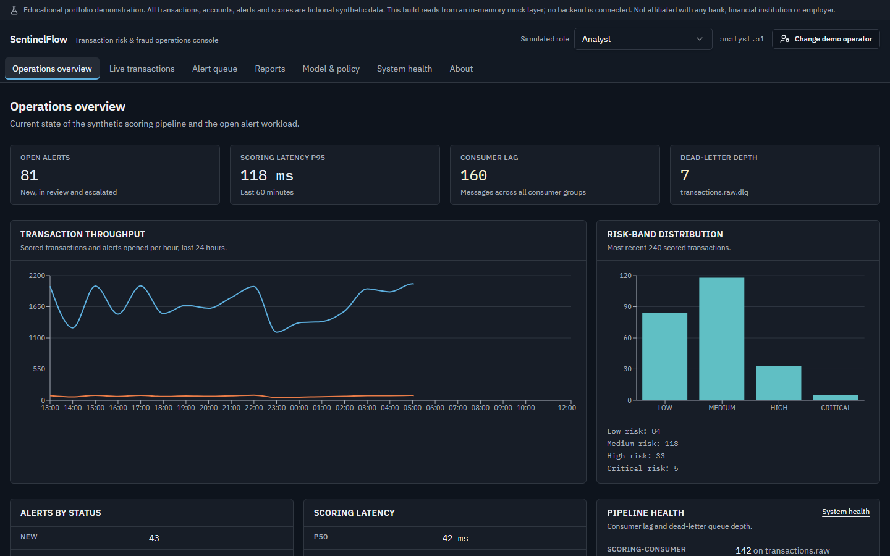
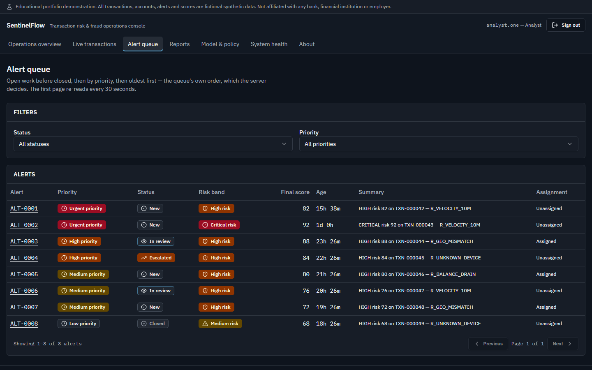
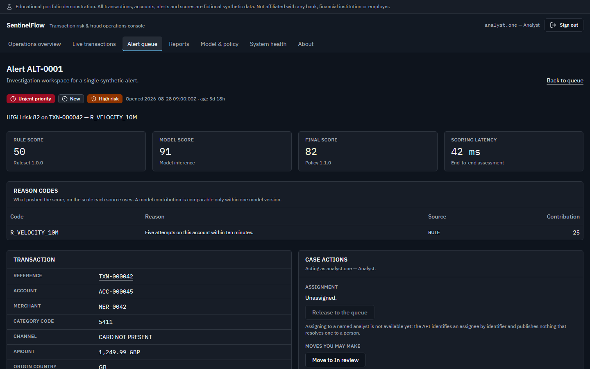
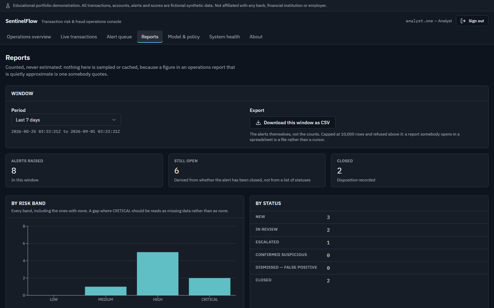
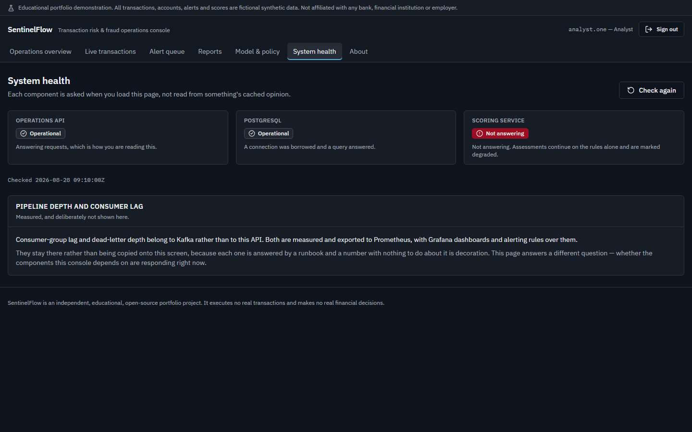
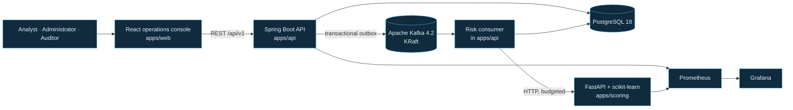
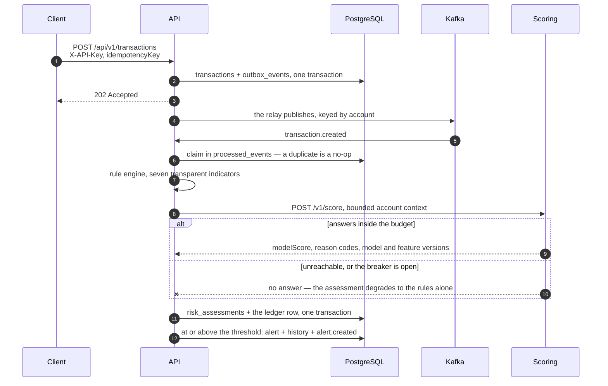
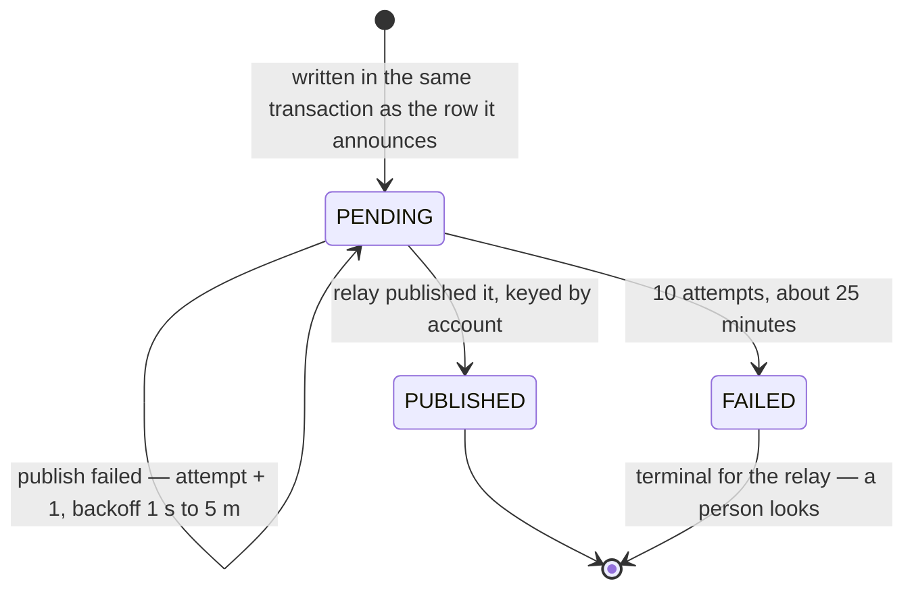
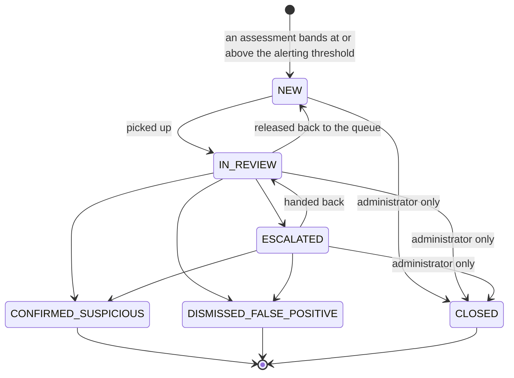
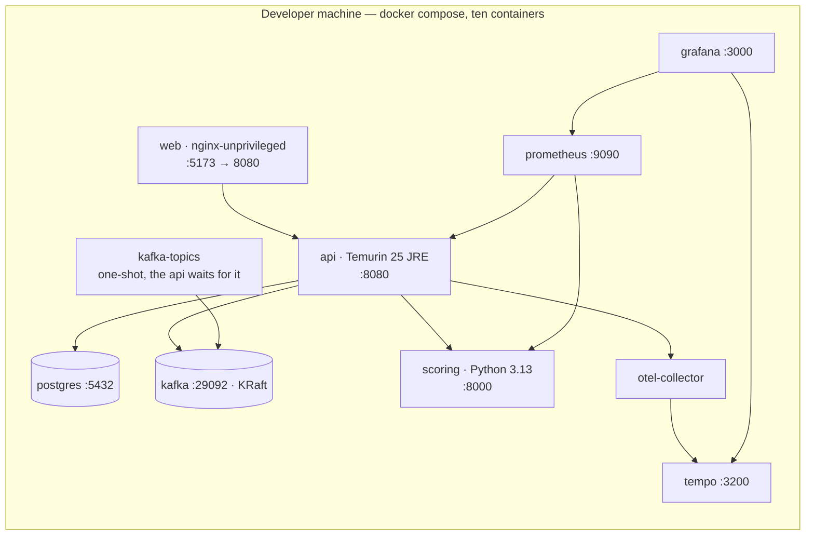

# SentinelFlow

**An event-driven transaction-risk and fraud-operations platform, built end to end on synthetic
data.** A transaction arrives, is published exactly once through a transactional outbox, scored by
a calibrated model and a transparent ruleset, and — when it bands high enough — becomes an alert an
analyst works to a defensible verdict.

[](https://github.com/la3679/sentinelflow/actions/workflows/ci-api.yml)
[](https://github.com/la3679/sentinelflow/actions/workflows/ci-scoring.yml)
[](https://github.com/la3679/sentinelflow/actions/workflows/ci-web.yml)
[](https://github.com/la3679/sentinelflow/actions/workflows/security-scan.yml)
[](LICENSE)

> **Read this first.** SentinelFlow is an **independent, educational, open-source portfolio
> project**. It is not affiliated with, endorsed by, or derived from any bank, financial
> institution, or employer. It runs entirely on **fictional synthetic data that it generates
> itself** — no real accounts, no real transactions, no personal data. It executes no financial
> transaction, makes no financial decision, and is neither a regulatory compliance product nor a
> production fraud-decision engine.
>
> Every figure in this README came from a command that was actually run, with the date recorded
> beside it.

---

## The console

**The overview** — what an analyst sees at the start of a shift: what is in the queue, and what the
risk looks like.



**The alert queue** — dense, filterable, and keyboard-operable, because an analyst is in it all day.



**The investigation workspace** — one alert, the rule and model scores that produced it, the reason
codes behind each, the transaction underneath, and the moves this operator may actually make.



**Reports** — a half-open window counted rather than sampled, with every key present including the
zeroes, and the same window downloadable as a file.



**System health** — each component asked when the page loads, and an honest account of the numbers
this screen deliberately does not carry.



All five are generated from the production bundle by
[`apps/web/tests/e2e/screenshots.spec.ts`](apps/web/tests/e2e/screenshots.spec.ts), so they cannot
drift from the build. **Every alert, score and figure in them is synthetic**, served by the
end-to-end suite's stub in the contract's own shapes.

Two things in these images are worth noticing because they are deliberate. The investigation screen
**says it cannot assign an alert to a person** rather than offering a control that would not work,
and the health screen **says where the pipeline figures actually live** rather than copying a number
onto a page with nothing to do about it.

## Why this project exists

Most portfolio projects are a CRUD application with a login screen. The interesting problems in
transaction risk are not CRUD problems:

- **A state change and the event announcing it must be atomic.** Writing a row and then publishing
  to Kafka is two operations with a window between them, and a crash in that window loses the event
  silently. SentinelFlow uses a transactional outbox.
- **Delivery is at-least-once, so consumers must be idempotent.** A duplicate is normal traffic,
  not an incident.
- **Money is never a float** — not in the database, the API, the events, or the UI.
- **Fraud labels are extremely imbalanced**, which makes accuracy close to meaningless. PR-AUC,
  precision, recall and an explicit operating threshold are what mean anything.
- **An alert is a workflow, not a row.** It has legal transitions, an assignee, an audit trail, and
  a verdict that has to be defensible months later.
- **An analyst stares at the console for a whole shift.** Density, keyboard operation and
  accessibility are functional requirements, not polish.

It draws on the kinds of responsibilities involved in enterprise transaction services, event
streaming and anomaly detection. It reproduces **no** proprietary code, schema, rule, metric or
workflow from any employer.

## What it does

| Capability                | What runs today                                                                                                                                        |
| ------------------------- | ------------------------------------------------------------------------------------------------------------------------------------------------------ |
| **Ingestion**             | `POST /api/v1/transactions` behind an API key, idempotent per account, size-capped and rate-limited; the row and its outbox event commit together.     |
| **Exactly-once handoff**  | A polling relay publishes each outbox row to Kafka keyed by account; the consumer claims every event in `processed_events` before doing any work.      |
| **Risk scoring**          | Seven transparent in-process indicators, plus a calibrated scikit-learn model over HTTP, combined under a versioned policy and banded.                 |
| **Graceful degradation**  | An unreachable scoring service degrades an assessment to the rules alone rather than losing it, behind a timeout, a bounded retry and a breaker.       |
| **Alert lifecycle**       | A banded assessment opens an alert, its first history row and its `alert.created` event in one transaction; an analyst then works a state machine.     |
| **Audit and concurrency** | Every mutation records the actor and the moment, and every one is checked against a concurrent change with a version and a `409`.                      |
| **Reporting**             | `GET /reports/alert-summary` over a half-open window with every key present including the zeroes, and a CSV export capped at 10,000 rows.              |
| **Operations console**    | Overview, transaction feed, alert queue and investigation workspace, reports, model and policy, and system health — every screen against the real API. |
| **Observability**         | Prometheus, five provisioned Grafana dashboards, thirteen alerting rules, ten runbooks, and W3C trace context that survives the asynchronous hop.      |

## Architecture



Every box and every link exists and runs. **The API is the only backend the console talks to**;
scoring is reached through the API and never directly by the browser, which leaves one
authorization boundary, one audit trail and one place to rate-limit
([ADR-0002](docs/adr/0002-monorepo-and-service-boundaries.md)).

The consumer's call to the scoring service is synchronous HTTP from inside the handler, with a
timeout, a bounded retry and a circuit breaker
([ADR-0008](docs/adr/0008-scoring-service-boundary.md)).

### How a transaction becomes an alert



The full annotated version, with the schema each step writes, is in
[`docs/architecture/TRANSACTION_TO_ALERT.md`](docs/architecture/TRANSACTION_TO_ALERT.md).

### Delivery, and what happens when it fails



The relay polls every 500 ms in batches of 100, which is the honest cost of an outbox: **nothing in
this pipeline is real-time** ([ADR-0005](docs/adr/0005-outbox-relay-mechanics.md)).

On the consuming side the budget is deliberately an order of magnitude shorter — five deliveries,
roughly half a minute — because a consumer's retry blocks its partition and is spent against every
record queued behind the failing one. After that the record is dead-lettered with a classified
failure reason and coordinates, and the partition moves on. A record that is not a readable
envelope at all is **not** dead-lettered: the dead-letter schema requires a valid envelope, and
[ADR-0006 §4](docs/adr/0006-event-schema-and-versioning.md) forbids copying unsanitised content
onto an operational topic, so it is counted and logged instead.

### The investigation workflow



Three properties of that graph are load-bearing rather than decorative:

- **A disposition needs a review.** `NEW` cannot go straight to a verdict. A queue that lets an
  alert be dismissed without being picked up is a queue that will be cleared rather than worked.
- **`CLOSED` is an administrative close and an administrator's alone.** It ends an investigation
  _without_ a disposition, which is the one move that removes work from a queue while recording
  nothing about the transaction.
- **Terminal means terminal.** No state with a close time has an outgoing move, because that
  timestamp is what "how long did this take to resolve" is computed from. Reopening is not a
  transition; it would be a new alert citing the same assessment, and it does not exist.

The graph and the roles that may walk it are defined in one place,
`apps/api/.../alert/AlertTransitions.java`, so the console renders controls from the same source
the API enforces.

### The contracts

`contracts/` is authoritative: changing one means updating the producers, the consumers, the tests
and the docs in the same change.

- [`contracts/openapi/sentinelflow-api.yaml`](contracts/openapi/sentinelflow-api.yaml) — the
  operator and ingestion API
- [`contracts/openapi/sentinelflow-scoring.yaml`](contracts/openapi/sentinelflow-scoring.yaml) —
  the scoring service, also browsable at <http://localhost:8000/docs> when the stack is up
- [`contracts/asyncapi/sentinelflow-events.yaml`](contracts/asyncapi/sentinelflow-events.yaml) —
  the Kafka topics and the event envelope
- [`contracts/schemas/`](contracts/schemas/) — the JSON Schemas each event payload is validated
  against

`make contracts-check` validates all three documents and every schema and example in them.

## Quick start

### Prerequisites

| Tool                            | Why                                          | Required                           |
| ------------------------------- | -------------------------------------------- | ---------------------------------- |
| Docker + Compose v2             | Runs the whole stack                         | yes                                |
| [Bun](https://bun.sh) ≥ 1.4     | The only Node package manager used           | yes                                |
| [uv](https://docs.astral.sh/uv) | Provisions Python 3.13                       | yes                                |
| Git                             | —                                            | yes                                |
| JDK 25 (Temurin)                | Only to build `apps/api` outside a container | no — `make up` builds it in Docker |

`make bootstrap` checks all of these and names the ones that are missing.

### Run it

```bash
git clone https://github.com/la3679/sentinelflow.git
cd sentinelflow
make bootstrap     # verify prerequisites, generate a local .env with fresh secrets
make up            # build and start everything, waiting until every service is healthy
make smoke         # 23 checks against the running stack
```

On Windows without `make`, every target is available natively in PowerShell —
`.\scripts\dev\sf.ps1 bootstrap`, `.\scripts\dev\sf.ps1 up`, and so on.



Every container runs as a non-root user and declares a health check, and CI asserts the non-root
user against the **built image** rather than trusting the Dockerfile.

**Nothing creates the Kafka topics implicitly.** Auto-creation is disabled, a one-shot
`kafka-topics` service creates them explicitly and the API waits for it — a decision
([ADR-0006 §3](docs/adr/0006-event-schema-and-versioning.md)) whose missing implementation step once
left every service reporting healthy while no message could be published.

| Service          | URL                                     |
| ---------------- | --------------------------------------- |
| Console          | <http://localhost:5173>                 |
| API health       | <http://localhost:8080/actuator/health> |
| Scoring health   | <http://localhost:8000/health/ready>    |
| Scoring API docs | <http://localhost:8000/docs>            |
| Prometheus       | <http://localhost:9090>                 |
| Grafana          | <http://localhost:3000>                 |

`make down` stops the stack and keeps your data. `make reset-demo` deletes the volumes, and asks
you to type `reset` first.

### The two-minute demo

```bash
make seed                          # deterministic synthetic parties and traffic
open http://localhost:5173         # sign in as analyst.one, work an alert
SCENARIO=scoring-outage make replay # watch assessments degrade, then recover
```

`make seed` writes the parties and the synthetic traffic the scenario generator lays over them,
through the same validation and the same outbox row as a posted transaction. Running it twice is a
no-op.

`make replay` runs the two things nothing else produces: a **scoring-service outage**, which stops
the scoring container, prints the degraded assessments the pipeline produced, restarts it, waits
out the circuit breaker's open window and prints the scored ones; and a **poison event**, which
publishes one well-formed envelope at an unsupported schema version — dead-lettered with its
failure class — and one record that is not a readable envelope at all, which is deliberately
counted and logged instead.

### Credentials

There are none to find and none committed. `make bootstrap` generates five random values into the
git-ignored `.env`: a PostgreSQL password, a Grafana admin password, the API's token-signing secret,
the password the seeded demo operators share, and the ingestion API key. **Compose refuses to start
when any of them is missing** rather than falling back to something guessable, so a half-generated
`.env` fails loudly at the first command rather than quietly at the tenth.

Four operators are seeded — `analyst.one`, `analyst.two`, `administrator.one` and `auditor.one` —
sharing the password in `SENTINELFLOW_DEMO_OPERATOR_PASSWORD`:

```bash
curl -sS -X POST http://localhost:8080/api/v1/auth/login \
  -H 'Content-Type: application/json' \
  -d "{\"username\":\"analyst.one\",\"password\":\"$SENTINELFLOW_DEMO_OPERATOR_PASSWORD\"}"
```

The token lasts thirty minutes and cannot be revoked before it expires, which is the trade
[ADR-0012](docs/adr/0012-operator-authentication.md) takes for a stateless API. The console signs in
against that same endpoint and holds the token in memory for the tab only, so a reload signs you
out. Every variable is documented in [`.env.example`](.env.example) with its default, whether it is
required, whether it is sensitive, and which component reads it.

### If something will not start

| Symptom                                             | Fix                                                                                 |
| --------------------------------------------------- | ----------------------------------------------------------------------------------- |
| `make up` fails on a missing secret                 | `.env` is missing or blank. Run `make bootstrap`.                                   |
| A port is already in use                            | Change it in `.env` — every published port is a variable.                           |
| PostgreSQL or Kafka refuses to start after a change | The volume was formatted differently. `make reset-demo`.                            |
| `bun install` fails with `ENAMETOOLONG` on Windows  | The clone path is too deep. Clone somewhere shorter, such as `C:\src\sentinelflow`. |
| Every assessment comes back `degraded`              | The scoring service is refusing the call. Runbook 4 has the sequence.               |

The rest, including how to get back to a clean database safely, is in
[`docs/operations/TROUBLESHOOTING.md`](docs/operations/TROUBLESHOOTING.md).

## Commands

```bash
make help              # every target, with a description
make up / down / ps / logs
make build             # build all three applications
make test              # every standard suite
make test-integration  # Testcontainers PostgreSQL + Kafka
make test-e2e          # Playwright, accessibility, responsive
make lint / format-check / security / smoke / docs-check / contracts-check
make bench             # benchmark the running stack, write the report
make seed / replay / reset-demo
```

## Technology

Every version is pinned, and justified in
[`docs/research/RESEARCH_LOG.md`](docs/research/RESEARCH_LOG.md).

| Choice                                   | Why this and not something else                                                                                                               |
| ---------------------------------------- | --------------------------------------------------------------------------------------------------------------------------------------------- |
| **Java 25 LTS + Spring Boot 4.1.1**      | Transactional integrity and the outbox belong where mature transaction management lives. LTS, because a stranger has to build this in a year. |
| **PostgreSQL 18.6**                      | `NUMERIC` for money, real constraints, partial indexes. Tested against real PostgreSQL — **H2 is never accepted as evidence**.                |
| **Apache Kafka 4.2.1, KRaft**            | The exact broker version the Spring Boot BOM's client targets. KRaft removes ZooKeeper from the stack entirely.                               |
| **Flyway**                               | Versioned, immutable, forward-only migrations. `ddl-auto` is `validate`, never `update`.                                                      |
| **Python 3.13 + FastAPI + scikit-learn** | The model belongs in the scientific stack. 3.13 exactly, because numpy needs ≥ 3.12 and joblib declares support only through 3.13.            |
| **uv**                                   | Provisions the interpreter and locks the tree, so the machine's system Python is irrelevant.                                                  |
| **React 19 + TanStack Router**           | Lovable's generated foundation, adopted after audit rather than rewritten ([ADR-0009](docs/adr/0009-frontend-component-library.md)).          |
| **Redux Toolkit + RTK Query**            | One data layer over one transport that attaches the token and maps every RFC 9457 body to one error shape.                                    |
| **shadcn/ui on Radix**                   | Radix supplies the focus management, keyboard interaction and ARIA semantics WCAG 2.2 AA needs. MIT, no paid tier.                            |
| **Prometheus + Grafana + Tempo**         | Scraping, dashboards and traces without an account or an egress dependency.                                                                   |

Deliberately **not** used: Redis, Kubernetes, GraphQL, a graph database, and an LLM. None has
demonstrated a need here, and adding one for appearance is how a portfolio project stops being
credible.

## Repository structure

```text
apps/api/        Spring Boot — ingestion, outbox, consumer, rules, alerts, audit, reports
apps/scoring/    FastAPI — features, inference, model registry
apps/web/        React operations console
contracts/       OpenAPI, AsyncAPI, and the event schemas — authoritative
data/            Synthetic generation profiles and exported datasets
infra/           Prometheus rules, Grafana dashboards, container configuration
scripts/         Bootstrap, smoke, benchmark, and checkpoint scripts
docs/            ADRs, architecture, ML, operations, security, testing, performance
compose.yaml     The whole local stack
Makefile         The command surface (PowerShell equivalent in scripts/dev/sf.ps1)
```

## Data and model methodology

**All data is generated by SentinelFlow's own code.** The generator plants six suspicious shapes —
velocity bursts, amount spikes, card testing, account drains, improbable geography and off-hours
activity on a new device — and its labels are recovered through an offline export so they never
enter the operational schema
([ADR-0010 §1](docs/adr/0010-model-selection-and-evaluation.md)).

**The ruleset is not a fallback bolted on afterwards.** Seven transparent indicators run in process
inside `apps/api` — `VELOCITY_5M_HIGH`, `AMOUNT_RATIO_HIGH`, `NEW_DEVICE`, `COUNTRY_CHANGE`,
`OFF_HOURS`, `BALANCE_DRAIN_HIGH` and `DISTINCT_MERCHANTS_1H_HIGH` — because something has to answer
when the scoring service cannot be reached. They are also the floor the model is measured against.

The shipped model is **calibrated logistic regression**, chosen against a rule fixed before
anything was measured: a model ships only if it beats the rules baseline by at least 0.05 PR-AUC,
and a gap inside the cross-validation fold spread goes to the simpler model. The baseline is the
**ruleset `apps/api` actually runs**, scoring every example as it was exported — not a Python
reimplementation, because two implementations drift and the drift presents as a model beating a
baseline nobody runs.

On a group-disjoint, time-ordered holdout of 2,499 rows: **PR-AUC 0.8327 against the ruleset's
0.2611**. Precision 1.0000 and recall 0.2000 at an operating point chosen to match a 1% review
budget from out-of-fold scores. **Accuracy is not reported at all** — under this class imbalance a
model answering "not suspicious" to everything scores extremely well on it, and a number that
exists gets quoted.

Full detail, including recall by planted shape and what the model must not be used for:
[`docs/ml/MODEL_CARD.md`](docs/ml/MODEL_CARD.md) and
[`docs/ml/EVALUATION.md`](docs/ml/EVALUATION.md). Provenance:
[`docs/data/DATA_PROVENANCE.md`](docs/data/DATA_PROVENANCE.md).

**One consequence of the banding policy is worth knowing.** Because the final score is floored by
the rule score, a transaction that trips no transparent indicator cannot reach the alerting band
however confident the model is. That is a stated policy rather than an accident, and
[ADR-0011 §4](docs/adr/0011-risk-banding-and-the-final-score.md) writes out the arithmetic and what
it costs.

## Testing and quality

**2026-08-31**, on the commit that closed the security-hardening phase:

| Suite                       | Result                                                                |
| --------------------------- | --------------------------------------------------------------------- |
| API — `./mvnw verify`       | **259 unit + 322 integration passed**, 0 failures, coverage gates met |
| Scoring — `uv run pytest`   | **187 passed**                                                        |
| Console — unit              | **41 passed**                                                         |
| Console — browser and a11y  | **88 passed**, axe clean on all eight routes at two viewports         |
| Contracts, docs, format     | **PASS** — contracts valid, every link resolves, formatting clean     |
| CodeQL on `refs/heads/main` | **0 results** — proved by planting a defect and seeing it caught      |

The API's integration suites run against **real PostgreSQL and real Kafka** in Testcontainers, on
the GitHub runner as well as locally. Two failures are drilled rather than described:
`ScoringOutageDrillIT` fails the scoring service under load and asserts every transaction is still
assessed and that the outage's cost is bounded by the breaker, and `BrokerOutageDrillIT` freezes the
broker mid-run and asserts ingestion keeps accepting and the backlog drains exactly once.

Coverage gates are ratchets: measured, set below the measurement, raised when a change genuinely
raises coverage, and never lowered to go green.

Method, history, coverage figures and what the suites do not cover:
[`docs/testing/TEST_RESULTS.md`](docs/testing/TEST_RESULTS.md).

## Performance

**Measured, not estimated.** `make bench` drives the running stack over HTTP and writes
[`docs/performance/BENCHMARK.md`](docs/performance/BENCHMARK.md) with the machine, the container
runtime and the dataset it ran against — a latency figure without those three is not reproducible.

Read latency, **2026-08-31**, against 20,947 transactions and 13,682 assessments on one developer
laptop running the whole ten-container stack:

| Endpoint                            | p50   | p95   | p99    |
| ----------------------------------- | ----- | ----- | ------ |
| `GET /alerts` (page 1, size 20)     | 22 ms | 37 ms | 110 ms |
| `GET /transactions` (page 1, 50)    | 27 ms | 40 ms | 45 ms  |
| `GET /transactions` (page 20, 50)   | 32 ms | 68 ms | 79 ms  |
| `GET /reports/alert-summary` (24 h) | 20 ms | 36 ms | 37 ms  |
| `GET /reports/alert-summary` (30 d) | 17 ms | 30 ms | 33 ms  |

A burst of 100 transactions at concurrency 8 was accepted in 0.78 s, and all 100 were scored,
banded and persisted **5.0 s** after that — measured from the database rather than from an endpoint,
because the question is when the pipeline finished. Kafka, the relay's 500 ms poll, the consumer and
the scoring call are all inside that one number, and roughly half a second of it is the poll before
anything else happens. **Nothing in this pipeline is real-time, and the design says so.**

**The one optimization so far, and how it was found.** `GET /transactions` was the slowest endpoint
by a factor of five. The SQL was captured from PostgreSQL's own statement log rather than
reconstructed, and `EXPLAIN (ANALYZE, BUFFERS)` moved the page query from **68.0 ms to 5.0 ms** and
its shared buffer hits from **71,256 to 6,155**. The cost was not the sort: it was a correlated
subquery resolving each transaction's latest assessment version, running **34,629 times** — for 98%
of the buffers — to return fifty rows, with no index for the query's `ORDER BY` to stop early.
[`V12__transactions_listing_index.sql`](apps/api/src/main/resources/db/migration/V12__transactions_listing_index.sql)
adds one, and carries both plans and the trade it accepts — one more index on the highest-volume
write path.

**What none of this measures:** sustained throughput (the rate limiter's ceiling is the binding
constraint by design, and the benchmark stays under it rather than raising it to flatter itself),
cold starts, the console, or any hardware but the one named in the report.

## Observability

`make up` brings up Prometheus, Grafana, an OpenTelemetry Collector and Tempo alongside the
applications, with the datasources and **five dashboards provisioned from files** — a fresh clone
needs no clicking. Prometheus is at <http://localhost:9090>, Grafana at <http://localhost:3000>.

**Thirteen alerting rules** live in
[`infra/prometheus/rules/sentinelflow.yml`](infra/prometheus/rules/sentinelflow.yml), each
annotated with the runbook section that answers it; there is no Alertmanager, so a firing rule
appears on Prometheus's own Alerts page rather than paging anybody. **Ten runbooks** cover
dead-letter growth, consumer lag, outbox backlog, scoring degradation, and six more, each naming
real metrics and commands that were run.

**W3C trace context survives the asynchronous hop.** The outbox stores the originating
`traceparent` and the relay replays it onto the Kafka record, so one transaction is a single trace
from the HTTP request through Kafka to the scoring call rather than two traces nothing joins
([ADR-0016 §5](docs/adr/0016-observability-signals-and-their-boundaries.md)). Neither the collector
nor Tempo gates anything: a tracing backend that is down must not stop the pipeline.

Every panel carries a description saying what its number means and what it does not, and what is
deliberately _not_ instrumented is explained in
[`docs/operations/OBSERVABILITY.md`](docs/operations/OBSERVABILITY.md).

## Security

Full policy: [`SECURITY.md`](SECURITY.md). **Report a vulnerability privately**, through
[a GitHub security advisory](https://github.com/la3679/sentinelflow/security/advisories/new) — never
as a public issue.

The threat model is STRIDE over four trust boundaries with every control traced to a test:
[`docs/security/THREAT_MODEL.md`](docs/security/THREAT_MODEL.md).

| Control                     | Where                                                                      |
| --------------------------- | -------------------------------------------------------------------------- |
| Ingestion credential        | `X-API-Key` on `POST /transactions`, compared in constant time             |
| Operator authentication     | Password for a short-lived bearer token; the server decides every mutation |
| Rate limiting               | Token bucket per caller; the strictest allowance is on `POST /auth/login`  |
| Request size bound          | 64 KiB, on the declared length **and** on the bytes delivered              |
| CSV export escaping         | Every field a spreadsheet would treat as a formula is escaped              |
| Log redaction               | Asserted at `logging.level.root=DEBUG` over five paths                     |
| Secret scanning             | gitleaks over full history, every push and pull request, plus weekly       |
| Static analysis             | CodeQL over Java, Python and TypeScript, every push and weekly             |
| Dependency review           | Fails a pull request on a high-severity or copyleft addition               |
| Container scanning          | Trivy on every image; fails on any fixable HIGH or CRITICAL                |
| SBOM                        | CycloneDX per image and for the source tree, with `SHA256SUMS`             |
| Non-root containers         | Asserted in CI against the built image                                     |
| Pinned actions              | Third-party actions pinned to an immutable commit SHA                      |
| Closed management endpoints | Only health, info and prometheus — asserted by test **and** by smoke       |
| Protected `main`            | Pull requests and nine passing checks, with no bypass actors               |

### Limitations, stated plainly

- **Ingestion carries a shared secret, not a per-caller identity.** One key for one caller: nothing
  distinguishes two pipelines, and an ingested transaction is not attributed to anybody in the audit
  trail ([ADR-0017 §1](docs/adr/0017-protecting-the-ingestion-surface.md)).
- **The rate limit is per API instance.** Two instances behind a load balancer would permit twice
  the configured rate, and a restart forgets who was being limited. Right for a single-instance
  demo, wrong for a real edge, where the limiter belongs in front.
- **`/actuator/prometheus` is unauthenticated.** A scrape cannot hold a token that expires every
  thirty minutes. Tracked as T-04 in the threat model, open and owned.
- **A token cannot be revoked before it expires**, so thirty minutes is the whole of how long a
  withdrawn role keeps working. That is the cost of a stateless token, and it is deliberate.
- **A reload signs the console out**, because the token lives in the tab's memory and never in
  browser storage. The sign-in screen says so rather than letting an analyst discover it mid-review.
- **The console cannot assign an alert to a person.** `assigneeId` is a UUID and nothing resolves it
  to a name, so releasing an alert back to the queue is the only assignment it can make — and the
  screen says why instead of offering a control that cannot work.
- **Nothing navigates from a transaction to its alert.** The route that exists is alert to
  transaction.
- **Role handling in the console is a UX affordance, never a security boundary.** Disabling a
  control authorizes nothing; the API decides.
- **The local stack is not a deployment target.** It binds to your machine, holds only synthetic
  data, and has never been hardened for exposure.
- **Screen-reader behaviour is unverified.** axe finds roughly a third of real accessibility
  issues, and every accessibility check here is one of the cheaper two-thirds. A pass with an actual
  screen reader needs a person using one; it has not happened, and nothing here should be read as
  saying otherwise.

## Design decisions

Eighteen ADRs record the decisions that shaped this system, each binding until superseded. The
ones that explain the most:

| Decision                                                                 | What it settles                                                            |
| ------------------------------------------------------------------------ | -------------------------------------------------------------------------- |
| [ADR-0005](docs/adr/0005-outbox-relay-mechanics.md)                      | Why a polling relay, and what its 500 ms costs                             |
| [ADR-0006](docs/adr/0006-event-schema-and-versioning.md)                 | Envelope, versioning, and what may never reach a dead-letter topic         |
| [ADR-0007](docs/adr/0007-money-identifiers-and-schema-migrations.md)     | Money as `NUMERIC`, identifiers, and forward-only migrations               |
| [ADR-0008](docs/adr/0008-scoring-service-boundary.md)                    | A synchronous call inside the handler, not a second Kafka round trip       |
| [ADR-0010](docs/adr/0010-model-selection-and-evaluation.md)              | The ship-or-not rule, fixed before anything was measured                   |
| [ADR-0011](docs/adr/0011-risk-banding-and-the-final-score.md)            | How a rule score and a model score combine into one banded decision        |
| [ADR-0012](docs/adr/0012-operator-authentication.md)                     | Stateless bearer tokens, the roles, and what that costs                    |
| [ADR-0015](docs/adr/0015-live-updates-polling-and-server-sent-events.md) | Bounded polling now; SSE when there is a stream worth carrying             |
| [ADR-0016](docs/adr/0016-observability-signals-and-their-boundaries.md)  | What each signal is allowed to be read as saying                           |
| [ADR-0017](docs/adr/0017-protecting-the-ingestion-surface.md)            | The ingestion credential, the limits, and what they do not solve           |
| [ADR-0018](docs/adr/0018-deployment-and-the-local-first-strategy.md)     | Local-first, no hosted demo, and what would have to be true to change that |

## Documentation

| Area                     | Start here                                                                               |
| ------------------------ | ---------------------------------------------------------------------------------------- |
| The main flow            | [`docs/architecture/TRANSACTION_TO_ALERT.md`](docs/architecture/TRANSACTION_TO_ALERT.md) |
| Data model               | [`docs/architecture/DATA_MODEL.md`](docs/architecture/DATA_MODEL.md)                     |
| API and event contracts  | [`contracts/`](contracts/)                                                               |
| Decisions                | [`docs/adr/`](docs/adr/)                                                                 |
| Model and evaluation     | [`docs/ml/MODEL_CARD.md`](docs/ml/MODEL_CARD.md)                                         |
| Data provenance          | [`docs/data/DATA_PROVENANCE.md`](docs/data/DATA_PROVENANCE.md)                           |
| Test results             | [`docs/testing/TEST_RESULTS.md`](docs/testing/TEST_RESULTS.md)                           |
| Benchmarks               | [`docs/performance/BENCHMARK.md`](docs/performance/BENCHMARK.md)                         |
| Observability            | [`docs/operations/OBSERVABILITY.md`](docs/operations/OBSERVABILITY.md)                   |
| Runbooks                 | [`docs/operations/RUNBOOKS.md`](docs/operations/RUNBOOKS.md)                             |
| Troubleshooting          | [`docs/operations/TROUBLESHOOTING.md`](docs/operations/TROUBLESHOOTING.md)               |
| Threat model             | [`docs/security/THREAT_MODEL.md`](docs/security/THREAT_MODEL.md)                         |
| Research and versions    | [`docs/research/RESEARCH_LOG.md`](docs/research/RESEARCH_LOG.md)                         |
| Planning and phase state | [`docs/planning/`](docs/planning/) · [`PROJECT_STATE.md`](PROJECT_STATE.md)              |
| Frontend audits          | [`docs/frontend/`](docs/frontend/)                                                       |
| Development environment  | [`docs/development/CLAUDE_CODE_SETUP.md`](docs/development/CLAUDE_CODE_SETUP.md)         |
| Contributing             | [`CONTRIBUTING.md`](CONTRIBUTING.md)                                                     |

## Status and roadmap

The pipeline, the console, observability and security hardening are built and tested. The current
work is performance, documentation and a clean-clone verification; after that comes the v1.0.0
release. Phase-by-phase state, with the evidence behind each gate, is in
[`PROJECT_STATE.md`](PROJECT_STATE.md) and
[`docs/planning/IMPLEMENTATION_PLAN.md`](docs/planning/IMPLEMENTATION_PLAN.md).

**Named and not yet built**, each deferred deliberately rather than forgotten: operator identity,
so an alert can be given to a person rather than to a UUID; endpoints for reprocessing a
dead-lettered event, reviving a failed outbox row and rescoring a degraded assessment, which today
have only a manual procedure in the runbooks; an authenticated, rate-limited HTTP replay endpoint,
which is API surface rather than a Makefile target and is scheduled as such; and a Server-Sent
Events stream, once there is a stream worth carrying.

## Deployment

**The local Docker Compose environment is the supported way to run SentinelFlow.** There is no
hosted demo, and this README will not link to one that does not exist. Public cloud deployment is
out of scope for v1 and would **incur cost** — nothing in this repository provisions a billable
resource.

That is a recorded decision rather than a gap:
[ADR-0018](docs/adr/0018-deployment-and-the-local-first-strategy.md) sets out why ten containers do
not fit a free tier, why nothing here was built to be exposed, and the five things that would have
to be true before it is revisited. It also fixes the clause most easily undone by accident — every
published port binds to `127.0.0.1`, verified with `docker port` rather than by reading the compose
file.

## Development

This repository was created by [Lovable](https://lovable.dev), which built the reviewed frontend
foundation; everything since has been built locally with Claude Code. The full history, including
Lovable's original root commit, is preserved — nothing has been squashed or rewritten. Moving the
console to `apps/web/` ended Lovable's ability to regenerate the project, a trade recorded with its
two honest routes back in
[`docs/operations/LOVABLE_GITHUB_WORKFLOW.md`](docs/operations/LOVABLE_GITHUB_WORKFLOW.md).

Contributions are welcome: [`CONTRIBUTING.md`](CONTRIBUTING.md) and
[`CODE_OF_CONDUCT.md`](CODE_OF_CONDUCT.md).

## Licence and acknowledgements

[Apache-2.0](LICENSE). See [`NOTICE`](NOTICE).

The initial frontend was generated by [Lovable](https://lovable.dev) and audited before adoption —
findings in [`docs/frontend/FOUNDATION_AUDIT.md`](docs/frontend/FOUNDATION_AUDIT.md).

Evaluation methodology for imbalanced fraud data was informed conceptually by the openly published
[Fraud Detection Handbook](https://github.com/Fraud-Detection-Handbook/fraud-detection-handbook).
**No code, prose, or images were copied** — it is GPLv3 and CC BY-SA, both incompatible with this
repository's licence. All synthetic data is generated by SentinelFlow's own code.
