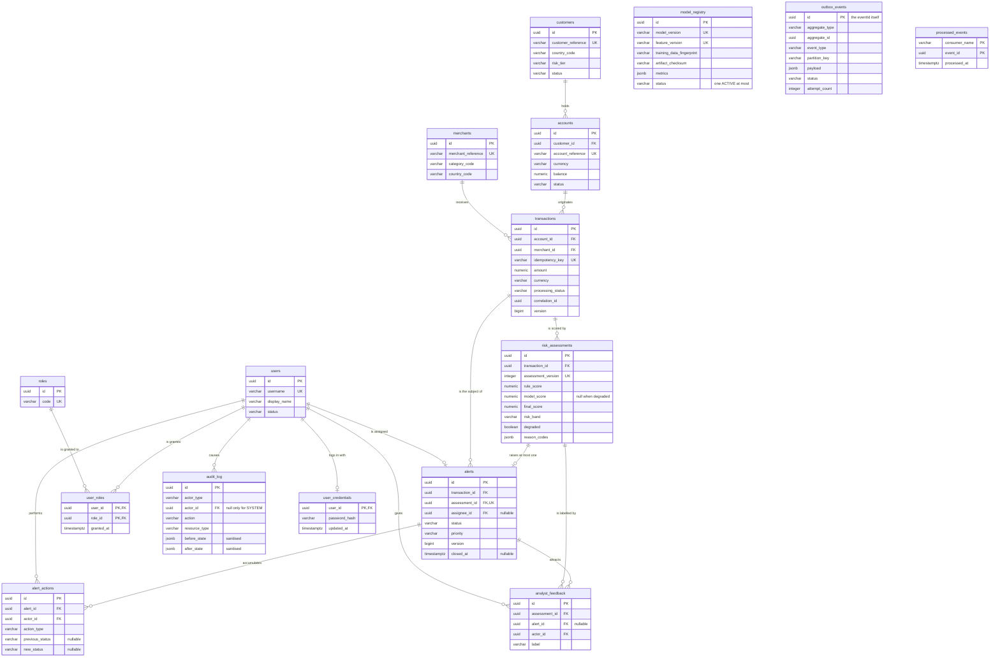

# Data model

The sixteen tables in `apps/api/src/main/resources/db/migration/`, how they relate, and why the
relationships are shaped the way they are.

**The migrations are authoritative.** Column lists are not repeated here, because a duplicated
column list is a thing that goes stale silently and then misleads someone. This document covers what
a migration file cannot show: the shape of the whole, and the reasoning behind it. Every relationship
and delete rule below was read out of `information_schema` on a database built by those migrations,
not recalled.

`SchemaDocumentationIT` asserts that the entity list below still matches the tables that exist, so
adding a table without updating this page fails a test.

---

## Entity relationships

---

## Why the shape is this shape

### Two tables have no foreign keys at all

`outbox_events` and `processed_events` reference aggregates by identifier and constrain nothing.
That is deliberate. An outbox row must survive the deletion of whatever it describes — the event
already went out, and a foreign key would let a retention job silently make a published event
unrepresentable. `processed_events` records that a consumer handled an event id, which is a fact
about the consumer, not a reference to a row that necessarily still exists locally.

`audit_log.resource_id` is untyped for the same reason: it points at whatever `resource_type` names,
across tables, and outlives all of them.

### Sixteen foreign keys, fourteen of them `RESTRICT`

The two exceptions are `user_roles.user_id` and `user_credentials.user_id`, which cascade. Neither a
role grant nor a password is a record of anything that happened; both are statements about a user,
and both mean nothing once the user is gone. Every other foreign key in this schema points at
history. Deleting a customer that still has accounts, or an
alert that still has actions, is either a mistake or a retention operation that has to deal with
what is underneath — and neither should happen as a side effect of a `DELETE`.

### A user without a credential is an ordinary user, and one of them matters

`user_credentials` is a table rather than a column on `users` because a credential has its own
lifecycle — rotated, revoked, absent — and because the system principal must never be able to log in
(ADR-0012 §2). With a nullable column that would be a rule somebody has to remember; as the absence
of a row it is structural, and the login path cannot find what does not exist.

No migration ever writes a row here. The demo operators are created by the application seed from a
password supplied through configuration, because a hash committed to a migration would be a
credential in the repository and the same one on every machine that ran it.

### One alert per assessment, many assessments per transaction

`alerts.assessment_id` is unique. Retrying the alert-raising path after a partial failure therefore
cannot open a second alert for the same decision. `risk_assessments` is unique on
`(transaction_id, assessment_version)` instead: rescoring under a new policy adds a row rather than
overwriting one, because the old assessment is what was acted on and an audit that cannot see it is
not an audit.

`alerts` also carries `transaction_id` directly, which is redundant through `assessment_id`. That
denormalisation is for the alert queue — the most frequent read in the product — which would
otherwise join through assessments on every page.

### Where money lives

`accounts.balance` and `transactions.amount` are `NUMERIC(19,4)`, each beside its own `currency`
column. Four fractional digits covers every ISO 4217 minor unit in use, three-decimal currencies
included. No binary floating point touches a monetary value at any layer (ADR-0007), and
`MigrationIT` asserts both columns are still `numeric`.

### Where JSONB lives, and where it does not

Four columns: `risk_assessments.reason_codes`, `model_registry.metrics`, and the two sanitised
`audit_log` state columns. Each is genuinely variable in shape and nothing queries an individual
member. Everything else is a column with a constraint on it. The domain does not live in JSON.

### Identifiers

Every primary key is `uuid` with a `DEFAULT uuidv7()`, which is PostgreSQL 18 and above. The
application assigns its own identifiers in the entity constructor, so the default only fires for a
direct SQL insert — a fixture, a `psql` session — and exists so that such an insert cannot introduce
a version 4 key and lose the index locality UUIDv7 was chosen for.

Business references (`CUS-000001`, `ACC-000001`, `MER-0001`, `TXN-000001`, `ALT-0001`) are unique,
format-constrained, and **never foreign keys**. They are handles for a human conversation.

### Time

Every timestamp column is `timestamptz`; `MigrationIT` asserts that none has appeared without a
zone. `transactions` keeps `occurred_at` and `ingested_at` separately, because a replayed scenario
occurred when the scenario says it did and was ingested now — collapsing them would make every
replayed transaction look as though it happened at import time and destroy every velocity feature
computed from it.

---

## Indexes that were chosen rather than inherited

Constraints create their own indexes. These six were added for a read path, and `MigrationIT`
asserts each still exists:

| Index                               | The query it serves                                          |
| ----------------------------------- | ------------------------------------------------------------ |
| `alerts_queue_idx`                  | The alert queue: open work, most urgent and oldest first     |
| `alerts_assignee_open_idx`          | One analyst's desk — partial, excludes closed and unassigned |
| `transactions_account_occurred_idx` | Every velocity feature and every account timeline            |
| `transactions_pending_idx`          | The scan for work to do — partial, `PENDING` only            |
| `outbox_events_due_idx`             | The relay's only query — partial, `PENDING` only             |
| `model_registry_single_active_idx`  | Not a read path: it _is_ the one-active-model rule           |

The partial ones matter for writes, not reads. `PENDING` is a transient state, so the published or
assessed majority never enters those indexes and never costs anything to maintain.

---

## Related

- [`TRANSACTION_TO_ALERT.md`](TRANSACTION_TO_ALERT.md) — how a transaction becomes an alert
- [`../adr/0007-money-identifiers-and-schema-migrations.md`](../adr/0007-money-identifiers-and-schema-migrations.md)
- [`../adr/0006-event-schema-and-versioning.md`](../adr/0006-event-schema-and-versioning.md)
- [`../data/DATA_PROVENANCE.md`](../data/DATA_PROVENANCE.md) — what fills these tables
