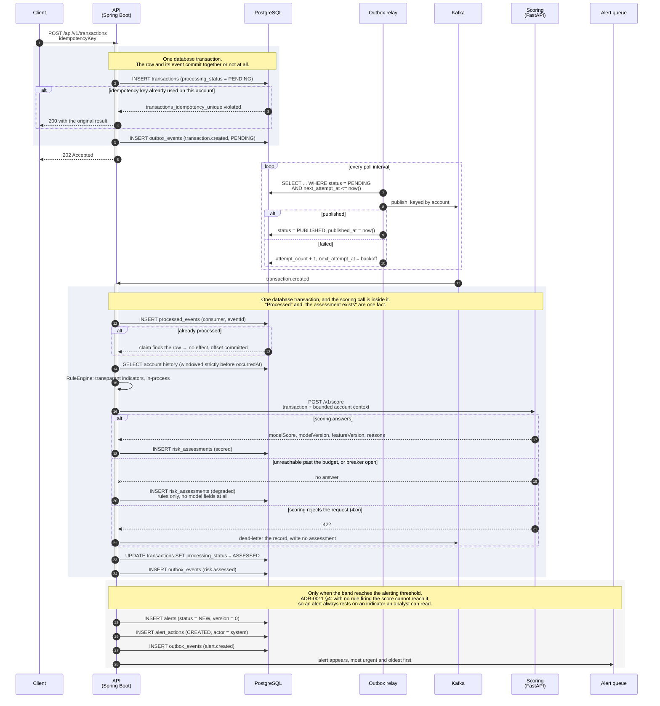
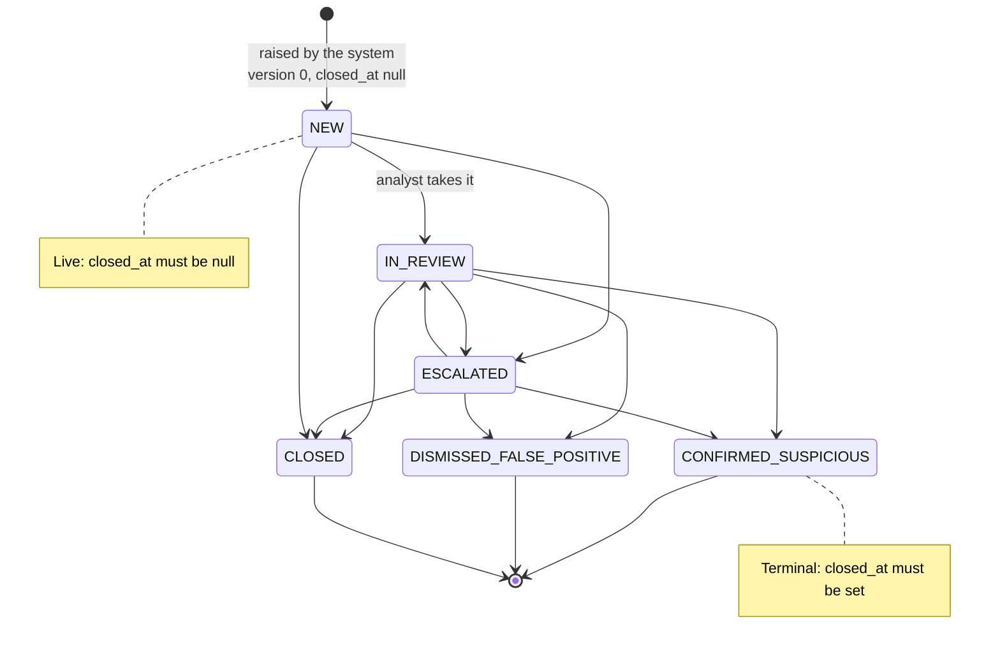

# From transaction to alert

The path a single synthetic transaction takes from arrival to an analyst's queue, and where each
row in the schema is written along the way.

> **Phase 5 status.** Every step below runs, including the last: an assessment that bands at or
> above the alerting threshold opens an alert, its first history row and its `alert.created` event
> in the assessment's own transaction, and an analyst moves it through the investigation state
> machine over an authenticated endpoint. All of it is tested end to end against a real broker and a
> real database.
>
> **What is not built yet:** assignment, notes, analyst feedback, and the reporting endpoints. An
> alert can be picked up, escalated, dispositioned and closed; it cannot yet be given to somebody.
>
> This page was written in Phase 2 and described scoring as a second Kafka consumer publishing
> `risk.assessed` back to the API. [ADR-0008](../adr/0008-scoring-service-boundary.md) §1 rejected
> that shape for three specific reasons and chose a synchronous call from inside the consumer's own
> handler. The diagram below is the shape that shipped.

---

## The flow

---

## What each step relies on

### Ingestion is idempotent because the database says so, not because the code checks

`transactions` is unique on `(account_id, idempotency_key)`. Ingestion is at-least-once by design
(ADR-0006), so a retried submission is normal traffic. Application code cannot provide this
guarantee on its own: a check-then-insert has a window between its two statements, and two retries
racing in different threads or different instances both pass the check.

Per account, not global — two clients choosing the same key for two different accounts are not
retries of each other, and refusing the second would drop a real transaction. Both halves are
asserted in `SchemaConstraintIT`.

### The event and the row commit together

Writing to PostgreSQL and then to Kafka is two commits with a window between them. Every crash in
that window either loses an event or publishes one describing a transaction that rolled back. The
outbox row is written inside the same database transaction as the business change; the relay
publishes it afterwards, and may publish it more than once.

`outbox_events.id` **is** the event id carried in the envelope — not a surrogate. Two identifiers for
one event would give a duplicate two identities and defeat the deduplication that at-least-once
delivery depends on.

`partition_key` is stored rather than derived at publication time, so the relay cannot change
partitioning by changing a getter, and a record read out of a dead-letter queue still says how it
was keyed.

### Duplicate delivery is a no-op, not a second effect

`processed_events` has a composite primary key of `(consumer_name, event_id)`, and the insert happens
in the same transaction as the effect. A second delivery is therefore a constraint violation to
swallow rather than a second alert to undo. Per consumer, because two consumers legitimately process
the same event and a global constraint would let whichever ran first silently suppress the other.

### A degraded assessment is a complete state, not a flag

When scoring is unreachable, the assessment is produced from rules alone. It has **no** model score,
**no** model version, **no** feature version, and zero scoring latency — because no scoring call
happened. A zero model score would be a claim about the transaction that nobody made.

`risk_assessments_degraded_consistent` permits exactly two shapes and no third, so the
half-populated row a partially-failed scoring path would otherwise write cannot be committed and
later read as a real model output. `RiskAssessment` has `scored()` and `degraded()` factories and no
public constructor, so the third shape is not constructible in Java either.

**It still names the ruleset and the policy that produced it.** Those are the only two versions a
degraded assessment has, and they are the two it most needs: the rules are the half that always
runs, and banding happens whether or not the model answered. `ruleset_version` was added in V8
because V4 had columns for the model, the features and the policy and none for the weights that set
the rule score's floor — which nothing had noticed, because nothing had ever written the table.

`make replay` demonstrates this against the running stack rather than describing it: it stops the
scoring container, posts transactions, prints the degraded assessments, restarts it and prints the
scored ones.

### Three outcomes, and only two of them write a row

[ADR-0008](../adr/0008-scoring-service-boundary.md) §2 separates "the dependency is briefly down"
from "the two services disagree about a contract", and the separation is behavioural:

| Scoring                     | What happens                                                       |
| --------------------------- | ------------------------------------------------------------------ |
| Answers                     | `scored` assessment, with both scores and every version            |
| Unreachable past its budget | `degraded` assessment, scored by the rules alone                   |
| Rejects the request (4xx)   | **No assessment.** The record is dead-lettered so somebody sees it |

Collapsing the last two into "scoring failed" is what the split exists to prevent. A contract
mismatch absorbed as a degraded assessment is a defect hidden behind a dashboard that still looks
healthy — which is not hypothetical: the first run of this pipeline against the real stack rejected
every request, and the dead-letter path is what made it visible within minutes rather than showing
up later as a model that mysteriously never contributed.

### Rescoring adds a row

`risk_assessments` is unique on `(transaction_id, assessment_version)`. A transaction re-run under a
new policy keeps its old assessment, because that is the decision that was acted on.

---

## The alert lifecycle

Three things hold across every transition:

**Every transition is recorded with both ends.** `alert_actions` rejects a `TRANSITIONED` row whose
`previous_status` is null or equal to `new_status`. A transition that does not say what it moved from
is not a record of a transition, and it cannot answer the question an audit asks.

**Every transition has an actor.** `alert_actions.actor_id` is not nullable. An automated transition
is attributed to the system principal that `V1__identity_and_reference_data.sql` inserts, so
"no actor" is not representable on a column whose whole purpose is attribution.

**A terminal alert has a close time and a live one does not.** `alerts_closed_at_consistent`
enforces both directions, which is what keeps "how long did this take to resolve" answerable for
every row rather than only for the ones the application remembered to stamp. `Alert.transitionTo`
sets and clears `closed_at` from the target status so application code cannot get this wrong.

### Two analysts, one alert

`alerts.version` is an optimistic lock. Two analysts opening the same alert and both acting is the
normal case in a shared queue, not an edge case, and the loser of that race must be told rather than
silently overwritten. A client reads `version`, sends it back as `expectedVersion`, and a mismatch is
a `409`.

The version is **opaque**. A new alert is at 0 — which is why the OpenAPI schema says `minimum: 0` —
and a client compares it for equality and never reads meaning into its magnitude. The
`alert.updated` event schema keeps `minimum: 1`, deliberately: that event only ever describes a
change, so by the time one is published the version has already been incremented at least once.

`EntityMappingIT` runs the race and asserts that the analyst who read first and submitted second
loses.

---

## Related

- [`DATA_MODEL.md`](DATA_MODEL.md) — the tables these steps write
- [`../adr/0006-event-schema-and-versioning.md`](../adr/0006-event-schema-and-versioning.md) — the
  envelope, the topics, and at-least-once with an outbox
- [`../adr/0008-scoring-service-boundary.md`](../adr/0008-scoring-service-boundary.md) — why the
  call is synchronous, what happens when it fails, and who owns the threshold
- [`../adr/0011-risk-banding-and-the-final-score.md`](../adr/0011-risk-banding-and-the-final-score.md)
  — how the two scores become one number, and what bands it
- [`../operations/RUNBOOKS.md`](../operations/RUNBOOKS.md) — what to do when assessments start
  degrading
- [`../../contracts/README.md`](../../contracts/README.md) — the authoritative API and event schemas
