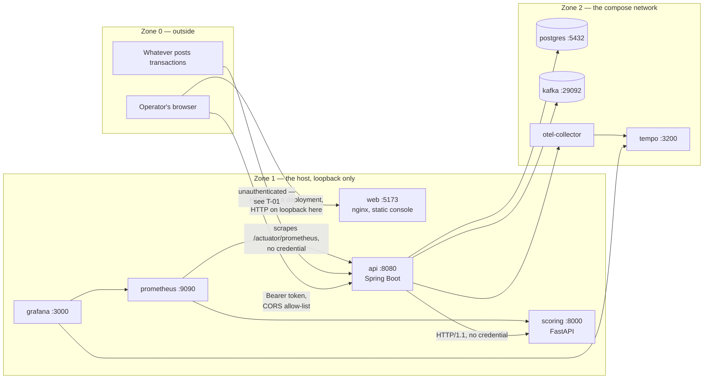

# SentinelFlow threat model

- **Status:** current as of 2026-08-31, Phase 8
- **Scope:** the system in this repository, as it actually is — not a generic fraud platform
- **Method:** STRIDE per element, over the trust boundaries drawn below
- **Related:** [ADR-0012](../adr/0012-operator-authentication.md),
  [ADR-0013](../adr/0013-console-to-api-cross-origin-access.md),
  [ADR-0016](../adr/0016-observability-signals-and-their-boundaries.md),
  [`SECURITY.md`](../../SECURITY.md)

## What this document is for, and what it is not

This is the threat model for an **educational demonstration running on synthetic data**. It is not a
security assessment of a bank system, and nothing here should be read as one. What makes it worth
writing anyway is that the demo has real surfaces — an HTTP API, a message broker, a database, a
browser client, a CI pipeline — and every one of them has the same failure modes it would have
anywhere. The point is to name them against the code that exists, decide each one, and leave the
decisions traceable.

Two rules govern what may appear below:

- **No invented findings.** Every entry names a file, a test, an ADR, or a command that was run.
- **No control claimed that is not there.** Where the answer is "nothing does this", the row says
  so and points at the section that owns it. A threat model that lists only solved problems is a
  marketing document.

**The single most important mitigation is not in this table.** SentinelFlow holds no real data.
Every customer, account, merchant and transaction is generated ([`docs/data/DATA_PROVENANCE.md`](../data/DATA_PROVENANCE.md)),
so the worst outcome of a total compromise of the demo stack is the disclosure of numbers a script
made up. Everything below is written as if that were not true, because the architecture is the thing
being demonstrated.

## The system, and where trust changes

Six processes and one browser, in four zones. Ports are the published host ports; every one of them
binds to `${SENTINELFLOW_BIND_ADDRESS:-127.0.0.1}` in [`compose.yaml`](../../compose.yaml).

**Boundary A — outside to the API.** The only boundary an attacker reaches without already being on
the host. Operator endpoints require a signed bearer token; `POST /api/v1/transactions` requires
nothing (T-01).

**Boundary B — the browser to the API.** Two origins, so a browser will not let the console read the
API's responses without being told it may. ADR-0013 names the origins explicitly, allows no
credentials, and registers the rule under `/api/v1/**` only. **This is not an authorization
control** — `curl` is unaffected — and `WebSecurityConfiguration`'s Javadoc says so in those words.

**Boundary C — the API to everything behind it.** PostgreSQL takes a generated password; Kafka takes
none; the scoring service takes none. All three are reachable from the host on loopback because
their ports are published for debugging.

**Boundary D — the repository to CI.** Workflows run with `contents: read` and escalate per job.
Third-party actions are pinned to commit SHAs. Dependabot opens pull requests that run the same
workflows as a human's.

## STRIDE, per boundary

Severity is for **this demo as it is deployed** — one machine, loopback, synthetic data. The
"if deployed" column is what the same finding would be worth on a network, because that is the
question a reader of a portfolio project is actually asking.

### Spoofing

| ID   | Threat                                                                     | Here                                                                                                                                                                           | Severity | If deployed |
| ---- | -------------------------------------------------------------------------- | ------------------------------------------------------------------------------------------------------------------------------------------------------------------------------ | -------- | ----------- |
| S-01 | Someone submits transactions as if they were the payment pipeline          | **Open.** `POST /api/v1/transactions` is `permitAll` (ADR-0012 §5). Tracked as **T-01**.                                                                                       | Low      | High        |
| S-02 | Forging an operator's token                                                | **Mitigated.** HS256 over a secret with no default and a 32-byte floor (`JwtProperties`); a token the service did not sign is refused, with a test that sends one.             | Low      | Low         |
| S-03 | Logging in as the `system` principal, whose actions the audit trail trusts | **Mitigated structurally.** `system` has no row in `user_credentials`, so the login path cannot find a credential to check (ADR-0012 §2). Tested by name.                      | Low      | Low         |
| S-04 | Username enumeration through the login response                            | **Mitigated.** A wrong password and an unknown username are refused identically, and there is a test asserting the two responses match rather than asserting each in turn.     | Low      | Low         |
| S-05 | A page on another origin reading the API as the signed-in operator         | **Mitigated.** Explicit origin allow-list, `allowCredentials` false, and the token lives in tab memory — so there is no ambient credential a cross-origin request could carry. | Low      | Low         |

### Tampering

| ID   | Threat                                                              | Here                                                                                                                                                                                                              | Severity | If deployed |
| ---- | ------------------------------------------------------------------- | ----------------------------------------------------------------------------------------------------------------------------------------------------------------------------------------------------------------- | -------- | ----------- |
| T-01 | Injecting synthetic transactions to move what the console shows     | **Open, deliberately** (ADR-0012 §5). Loopback binding is the whole of the containment. Fix: an ingestion credential, with rate and payload limits beside it — Phase 8's own deliverable.                         | Medium   | High        |
| T-02 | SQL injection                                                       | **Mitigated by construction.** Spring Data JPA with bound parameters; no string-concatenated SQL in `apps/api/src/main`.                                                                                          | Low      | Low         |
| T-03 | A malicious value in an exported CSV executing in a spreadsheet     | **Mitigated.** `CsvWriter` prefixes any cell beginning `= + - @ TAB CR` with an apostrophe. 17 unit tests plus an integration test that exports a summary a spreadsheet would execute.                            | Low      | Medium      |
| T-04 | Editing an alert someone else is working, silently                  | **Mitigated.** Alerts carry a version; the API answers `409` and the console re-reads and offers the move again, with an e2e test that drives the conflict.                                                       | Low      | Low         |
| T-05 | An unparseable or hostile Kafka payload reaching operational topics | **Mitigated by refusal.** A message that is not a readable envelope is never dead-lettered — ADR-0006 §4 forbids copying unsanitised content onto an operational topic.                                           | Low      | Low         |
| T-06 | A poisoned dependency entering through a bump                       | **Partly mitigated.** Dependency review fails on HIGH and denies copyleft licences; Dependabot bumps are verified locally before merge, and the round is written up in `PROJECT_STATE.md`. No SBOM yet — Phase 8. | Medium   | Medium      |

### Repudiation

| ID   | Threat                                                     | Here                                                                                                                                                                                      | Severity | If deployed |
| ---- | ---------------------------------------------------------- | ----------------------------------------------------------------------------------------------------------------------------------------------------------------------------------------- | -------- | ----------- |
| R-01 | An operator denies a decision they recorded                | **Mitigated.** Every state change writes an `alert_actions` row with a non-null `actor_id` and the role held **at the time** (ADR-0012 §3). Unattributable is not representable.          | Low      | Low         |
| R-02 | An action attributed to the wrong role after a role change | **Mitigated by design, bounded by the token.** The audit row records the role in the token, which is the role being exercised. A withdrawn role stays usable for up to 30 minutes (T-08). | Low      | Medium      |
| R-03 | Ingested transactions are unattributable                   | **Open, and a consequence of T-01.** Nothing identifies the ingestion caller, so nothing can be attributed to it.                                                                         | Low      | Medium      |

### Information disclosure

| ID   | Threat                                                  | Here                                                                                                                                                                                                                                                | Severity | If deployed |
| ---- | ------------------------------------------------------- | --------------------------------------------------------------------------------------------------------------------------------------------------------------------------------------------------------------------------------------------------- | -------- | ----------- |
| I-01 | Sensitive values in logs                                | **Mitigated, and the mitigation was widened after it failed.** ADR-0016 §4 makes redaction a property of what is logged. `LogRedactionIT` runs at `logging.level.root=DEBUG`; raising it one notch found four leaks at once, all fixed.             | Low      | Medium      |
| I-02 | `/actuator/prometheus` readable without a credential    | **Open, scoped.** A scrape cannot hold a 30-minute token. Series are aggregate counters and timers with closed label sets — no identifier, no amount, no payload — so it discloses traffic shape. Fix: a management port not published to the host. | Low      | Medium      |
| I-03 | A stack trace or framework message reaching a client    | **Mitigated.** RFC 9457 problem responses; the actuator exposes only health, info and prometheus, asserted by test **and** by `make smoke`.                                                                                                         | Low      | Low         |
| I-04 | Session or token material readable from browser storage | **Mitigated, and enforced.** The token is held in tab memory; `tests/unit/no-browser-storage.test.ts` fails the build if authorization state reaches `localStorage` or `sessionStorage`.                                                            | Low      | Medium      |
| I-05 | Secrets committed to the repository                     | **Mitigated.** gitleaks over full history on every push and pull request, weekly on a schedule; `.env` is generated by `make bootstrap` and git-ignored; `SENTINELFLOW_JWT_SECRET` and `POSTGRES_PASSWORD` have no defaults.                        | Low      | Low         |
| I-06 | The scoring service answering anyone who reaches it     | **Open, scoped.** No credential on `apps/scoring`; it is an internal service on the compose network whose port is published to loopback for debugging. It holds a model and synthetic features, not data.                                           | Low      | Medium      |
| I-07 | An operator seeing more than their role allows          | **Mitigated on the server.** An auditor's token gets `403` on every mutation, one test per mutating endpoint. Console role handling is a UX affordance and never a boundary (`.claude/rules/frontend.md`).                                          | Low      | Low         |

### Denial of service

| ID   | Threat                                                       | Here                                                                                                                                                                                                     | Severity | If deployed |
| ---- | ------------------------------------------------------------ | -------------------------------------------------------------------------------------------------------------------------------------------------------------------------------------------------------- | -------- | ----------- |
| D-01 | Unbounded list, export or report responses                   | **Mitigated.** `MAX_PAGE_SIZE` 200 on both list endpoints, refused rather than clamped, with a test; export capped at `MAX_EXPORT_ROWS` 10,000; the report window at 366 days, both refused with a test. | Low      | Low         |
| D-02 | Flooding the API with requests                               | **Open. There is no rate limiting anywhere in this repository** — confirmed by search on 2026-08-31, in `apps/api` and `apps/scoring` alike. Tracked as **T-02**.                                        | Medium   | High        |
| D-03 | Flooding the unauthenticated ingestion endpoint specifically | **Open**, and the compounding of T-01 and D-02: no credential and no limit on the one endpoint that writes to the database and the outbox on every call.                                                 | Medium   | High        |
| D-04 | An enormous request body                                     | **Open.** Nothing sets a maximum request size; the container default is whatever Spring Boot ships. Belongs with T-02.                                                                                   | Low      | Medium      |
| D-05 | The scoring service being slow or gone                       | **Mitigated by design.** ADR-0008 degrades rather than blocks: an assessment is written `degraded` and no alert is raised from a model that did not answer (ADR-0011 §4).                                | Low      | Low         |
| D-06 | A poison message stalling the consumer                       | **Mitigated.** Bounded jittered retry, then the dead-letter topic; `FAILED` is terminal (ADR-0005). Drill evidence is in `PROJECT_STATE.md` under Phase 7.                                               | Low      | Low         |

### Elevation of privilege

| ID   | Threat                                                  | Here                                                                                                                                                                                                       | Severity | If deployed |
| ---- | ------------------------------------------------------- | ---------------------------------------------------------------------------------------------------------------------------------------------------------------------------------------------------------- | -------- | ----------- |
| E-01 | An endpoint added later being reachable unauthenticated | **Mitigated by default-deny.** `anyRequest().authenticated()`, so a forgotten endpoint is protected rather than exposed.                                                                                   | Low      | Low         |
| E-02 | Role checks silently passing                            | **Mitigated.** `@EnableMethodSecurity` is on, and its absence is called out in the Javadoc as the way authorization fails worst — inert annotations that report nothing.                                   | Low      | Low         |
| E-03 | A token outliving the role it carries                   | **Open, bounded.** 30-minute expiry, no revocation. Tracked as **T-08**.                                                                                                                                   | Low      | Medium      |
| E-04 | A container process running as root                     | **Mitigated.** All three images run non-root, asserted in CI against the built image rather than read from the Dockerfile.                                                                                 | Low      | Low         |
| E-05 | A workflow with more permission than its job needs      | **Mitigated.** `permissions: contents: read` at the top of every workflow, escalated per job only where a job needs it; third-party actions pinned to commit SHAs.                                         | Low      | Low         |
| E-06 | A pull request merging without review or checks         | **Mitigated.** `main` is protected by ruleset `main protection`: pull requests required, checks required, no bypass actors ([`docs/operations/BRANCH_PROTECTION.md`](../operations/BRANCH_PROTECTION.md)). | Low      | Low         |

## Controls that exist, and the test each traces to

The Phase 8 gate asks for controls **traceable to tests and docs**. This is that trace. Every row
names something that runs.

| Control                                     | Where it lives                                                   | What proves it                                                                                                                        |
| ------------------------------------------- | ---------------------------------------------------------------- | ------------------------------------------------------------------------------------------------------------------------------------- |
| Default-deny authorization                  | `WebSecurityConfiguration`                                       | `OperatorAuthenticationIT` — "a protected endpoint refuses an anonymous request in the shape every other error has"                   |
| Token signature verification                | `TokenIssuer`, resource server                                   | `OperatorAuthenticationIT` — "a token this service did not sign is refused"                                                           |
| Identical refusal for bad user and password | `OperatorLoginService`                                           | `OperatorAuthenticationIT` — "a wrong password and an unknown username are refused identically"                                       |
| The `system` principal cannot log in        | V10 `user_credentials`, ADR-0012 §2                              | `OperatorAuthenticationIT` — "the system principal cannot log in, because it has no credential to log in with"                        |
| Secret length floor and expiry ceiling      | `JwtProperties`                                                  | `JwtPropertiesTests`                                                                                                                  |
| CORS allow-list, no credentials             | `WebSecurityConfiguration`, ADR-0013                             | `OperatorAuthenticationIT` — the preflight test, and "the actuator is not a browser surface"; `CorsPropertiesTests`                   |
| Auditor is read-only, on the server         | `@PreAuthorize` on each mutation                                 | `AlertOperationsIT` — one refusal test per mutating endpoint                                                                          |
| Page-size cap, refused not clamped          | `AlertController`, `TransactionController` (`MAX_PAGE_SIZE` 200) | `AlertOperationsIT` — "a page size above the cap is refused rather than clamped"                                                      |
| Export row cap (10,000)                     | `AlertReportService.MAX_EXPORT_ROWS`                             | `AlertReportIT`                                                                                                                       |
| Report window cap (366 days)                | `ReportController.MAX_WINDOW`                                    | `AlertReportIT` — "a window wider than the maximum is refused"                                                                        |
| CSV formula-injection defence               | `CsvWriter`                                                      | `CsvWriterTests` (17 tests, run 2026-08-31) and `AlertReportIT` — "a summary a spreadsheet would execute is exported as text instead" |
| Optimistic concurrency on alerts            | `Alert.version`, `409` handling                                  | `AlertTransitionIT`; e2e — "a transition answers 409 by re-reading the alert and offering the move again"                             |
| Log redaction                               | DTO and payload `toString`, `application.yaml`, ADR-0016 §4      | `LogRedactionIT` at `logging.level.root=DEBUG`                                                                                        |
| No token in browser storage                 | `sessionSlice`, frontend rules                                   | `tests/unit/no-browser-storage.test.ts`                                                                                               |
| Closed management surface                   | `application.yaml` actuator exposure                             | `OperatorAuthenticationIT`, and `make smoke` against the running stack                                                                |
| Loopback-only publishing                    | `compose.yaml`, `SENTINELFLOW_BIND_ADDRESS`                      | `docker port` on the running stack — the command, because reading the file is what got this wrong before                              |
| Secret scanning                             | `security-scan.yml`, gitleaks over full history                  | Runs on every push, every pull request, and weekly                                                                                    |
| Dependency review                           | `security-scan.yml`, `fail-on-severity: high`                    | Runs on every pull request                                                                                                            |
| Container scanning                          | `ci-containers.yml`, Trivy on all three images                   | Fails on any fixable HIGH or CRITICAL                                                                                                 |
| Non-root containers                         | Three Dockerfiles                                                | Asserted in CI against the built image                                                                                                |
| Least-privilege workflows                   | All seven workflows                                              | Reviewed 2026-08-31; see "Workflow permission review" below                                                                           |
| Protected default branch                    | Ruleset `main protection`                                        | `docs/operations/BRANCH_PROTECTION.md`                                                                                                |

## What is open, and who owns it

Numbered so other documents can cite them. **These are the inputs to the rest of Phase 8.**

| #    | Open item                                                | Owner                                                                                     |
| ---- | -------------------------------------------------------- | ----------------------------------------------------------------------------------------- |
| T-01 | Ingestion has no credential (S-01, T-01, R-03, D-03)     | Phase 8 — authentication hardening                                                        |
| T-02 | No rate limiting anywhere (D-02, D-03)                   | Phase 8 — rate and size limits                                                            |
| T-03 | No maximum request size (D-04)                           | Phase 8 — rate and size limits                                                            |
| T-04 | `/actuator/prometheus` open (I-02)                       | Phase 8 — a management port, or an accepted risk                                          |
| T-05 | The scoring service has no credential (I-06)             | Phase 8 — decide; internal-only may be the answer                                         |
| T-06 | No CodeQL                                                | Phase 8 — scanning                                                                        |
| T-07 | No SBOM and no release checksums                         | Phase 8 — supply chain                                                                    |
| T-08 | A token cannot be revoked before it expires (E-03, R-02) | Accepted, with the expiry as the mitigation (ADR-0012). Revisit only if the demo needs it |

## Workflow permission review — 2026-08-31

Recorded rather than performed, because the work was already done as each workflow was written. All
seven declare `permissions: contents: read` at the top.

| Workflow                      | Escalation                                                                      | Justified                                                                                                                                                                                                                                              |
| ----------------------------- | ------------------------------------------------------------------------------- | ------------------------------------------------------------------------------------------------------------------------------------------------------------------------------------------------------------------------------------------------------ |
| `ci-api.yml`                  | none                                                                            | —                                                                                                                                                                                                                                                      |
| `ci-scoring.yml`              | none                                                                            | —                                                                                                                                                                                                                                                      |
| `ci-web.yml`                  | none                                                                            | —                                                                                                                                                                                                                                                      |
| `ci-repo.yml`                 | none                                                                            | —                                                                                                                                                                                                                                                      |
| `ci-containers.yml`           | none                                                                            | —                                                                                                                                                                                                                                                      |
| `security-scan.yml`           | `pull-requests: read` (secrets job), `pull-requests: write` (dependency review) | gitleaks enumerates a PR's commits; dependency review posts its result                                                                                                                                                                                 |
| `dependabot-bun-lockfile.yml` | `contents: write`                                                               | It pushes a regenerated `bun.lock` to the Dependabot branch. **This is the one workflow that can write to the repository**, and its own header records the consequence: a push made with the default `GITHUB_TOKEN` cannot start further workflow runs |

Third-party actions are pinned to commit SHAs; first-party `actions/*` are pinned to release tags.

## Assumptions this model rests on

State them, because a threat model is only valid where they hold.

1. **The data is synthetic.** If real data ever entered this system, every severity above is wrong.
2. **The stack runs on one machine, on loopback.** `SENTINELFLOW_BIND_ADDRESS` exists to break this
   deliberately, and the README says not to put the stack on a network you do not control.
3. **There is no TLS in the local stack.** Everything is HTTP on loopback. A deployment would
   terminate TLS in front of the API and the console, and nothing in this repository does that.
4. **The operator's machine is trusted.** A token in tab memory is safe from browser storage and
   from another origin; it is not safe from the person at the keyboard or from malware on the host.
5. **The container runtime is trusted.** Nothing here defends against a hostile Docker daemon.
6. **CI secrets are GitHub's to protect.** This repository has no deployment credentials.

## Review

Revisit this document when a trust boundary moves — a new external caller, a second data store,
anything that terminates TLS, or an identity provider — and at each remaining phase gate. The open
items above are the checklist Phase 8 closes against; Phase 10 cannot ship with one silently
dropped.
